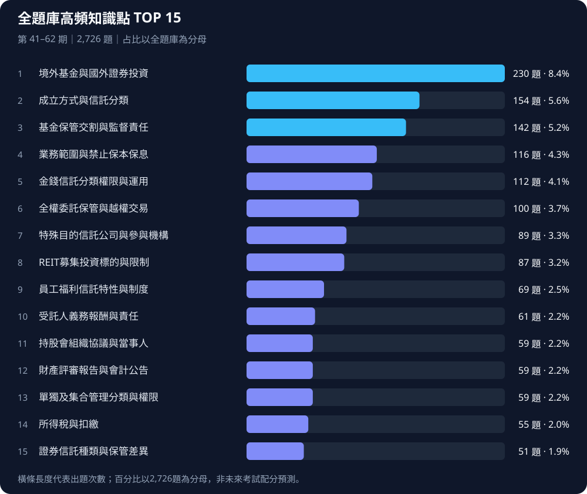
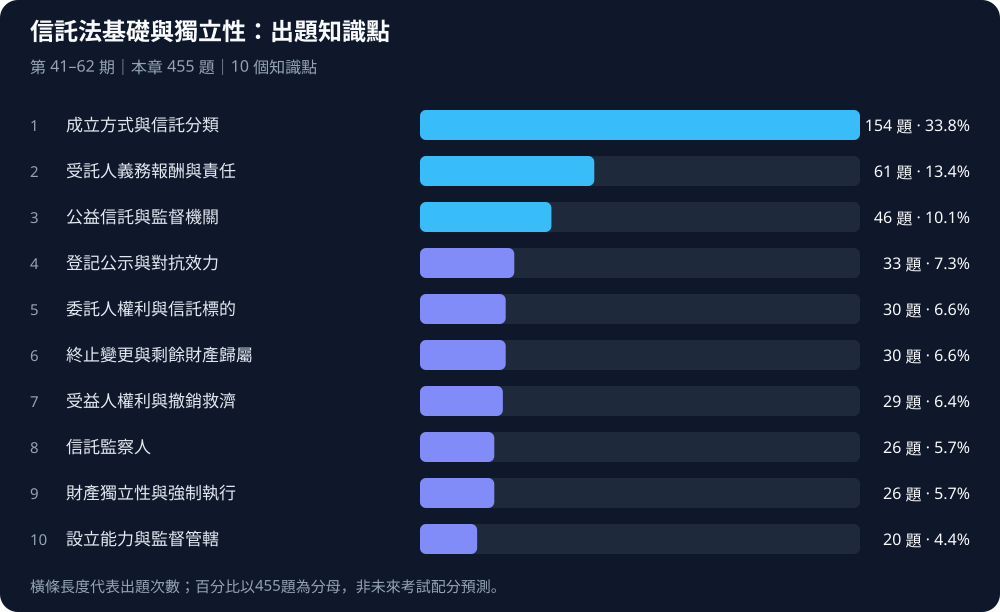
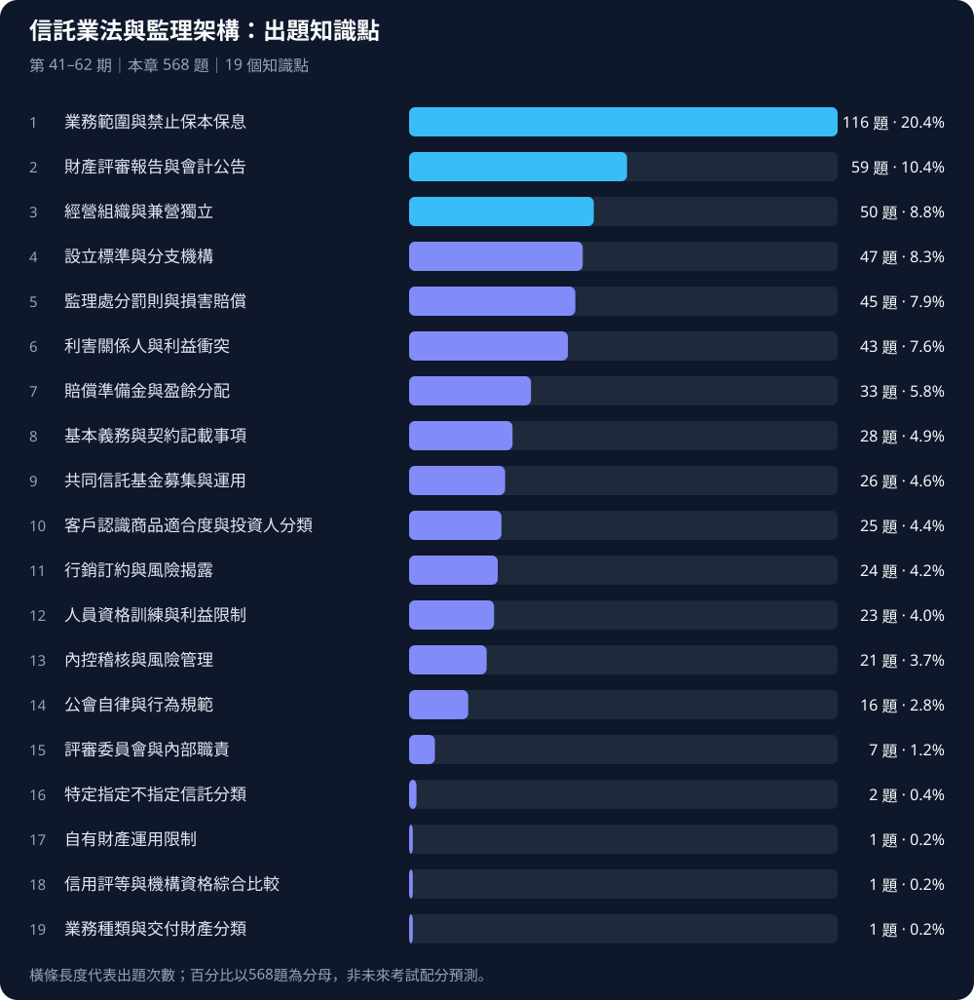
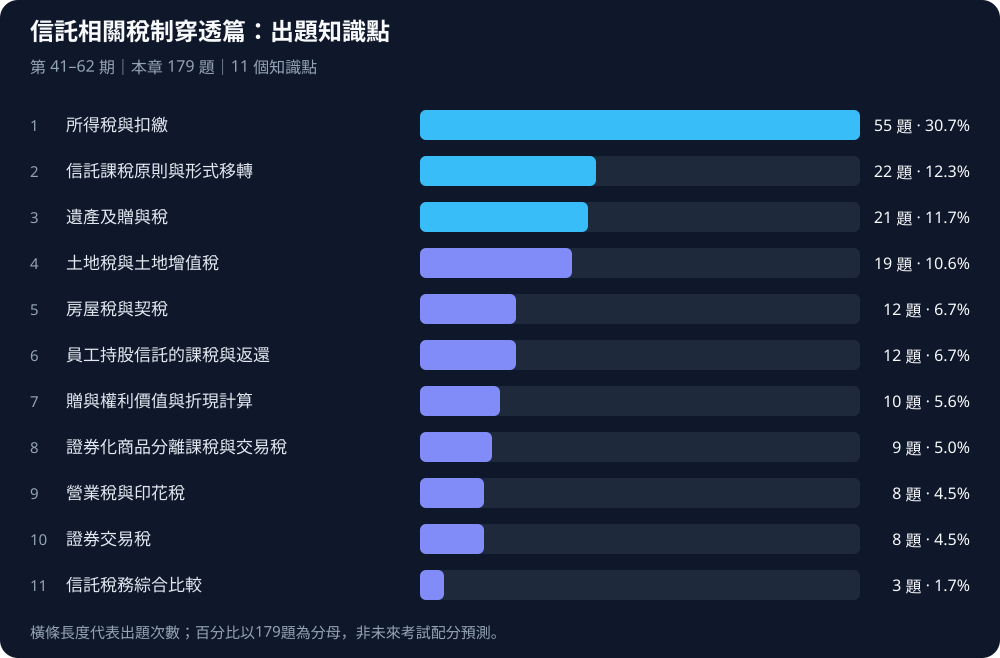
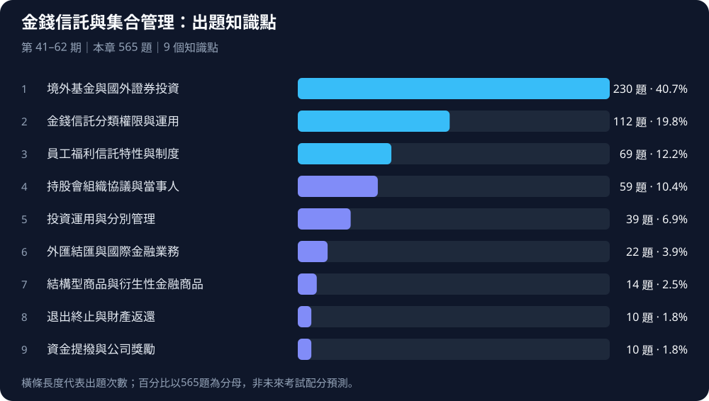
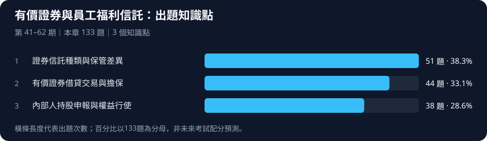
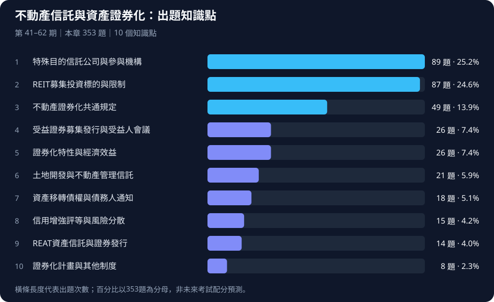
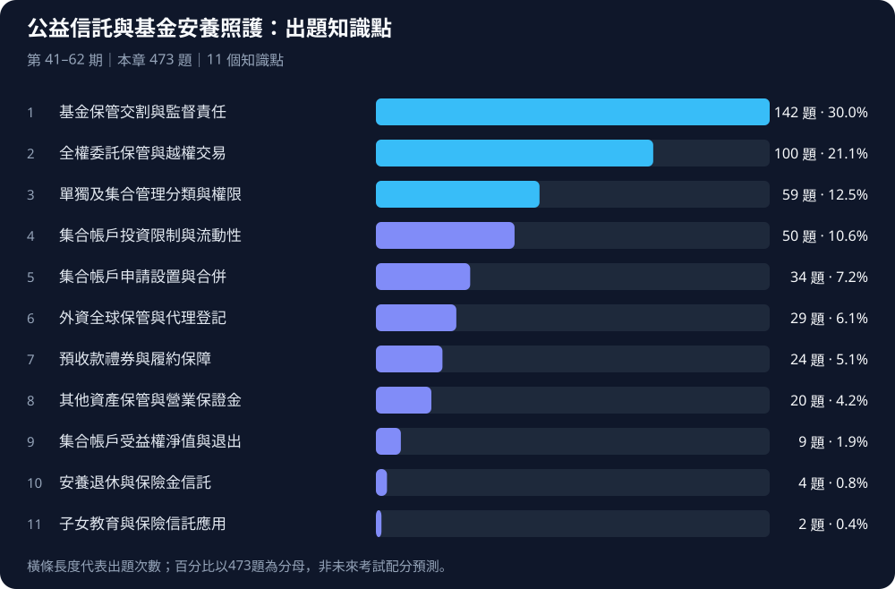

# 臺灣信託業務人員專業測驗：生活圖解重點教材

> **編撰依據**：依據中華民國現行《信託法》、《信託業法》、《不動產證券化條例》、《金融資產證券化條例》、信託稅法及金管會最新函令，深度解析**第 41 期至第 62 期歷屆考古題（共 2,860 題）**之高頻出題邏輯。
> **核心特色**：
> 1. **大量視覺化圖表**：全模組採用 Mermaid 流程圖、架構圖、對照表，建立視覺化空間記憶。
> 2. **生活化白話比喻**：以日常故事與形象譬喻（如防彈衣、防火牆、水管穿透）拆解晦澀法條。
> 3. **保留法規原意與嚴謹度**：標明條號、法定要件、例外規定，絕不因白話化而失真。
> 4. **考古題高頻考點直擊**：精準標註「何者錯誤」逆向題陷阱、必背關鍵字與歷屆常考陷阱。

---

## 📚 教材模組目錄地圖

<!-- topic-statistics:start -->

---

## 📊 歷屆出題知識點統計

統計範圍：**第 41–62 期｜2,726 題、73 個知識點**。依 c01–c07 完整題庫的知識點分類計算，每筆來源題計一次；不同期別的相同題目仍各計一次。第 08 章為跨章速查切片，不重複納入。

> 教材前言的 2,860 題是歷屆原始總量；以下圖表以目前 c01–c07 已收錄且分類的 **2,726 題**為準。出題次數僅反映本站收錄題目，不代表未來配分。

### 全題庫高頻知識點 TOP 15

### 各章完整知識點分布

展開各章可查看全部知識點；點擊圖表可放大檢視。各章百分比以該章收錄題數為分母。

🛡️ 信託法基礎與獨立性｜455 題

🏢 信託業法與監理架構｜568 題

💧 信託稅制全攻略穿透篇｜179 題

🌊 金錢信託與集合管理｜565 題

📈 有價證券與員工福利信託｜133 題

🏗️ 不動產信託與資產證券化｜353 題

🏛️ 公益信託與基金安養照護｜473 題

<!-- topic-statistics:end -->
