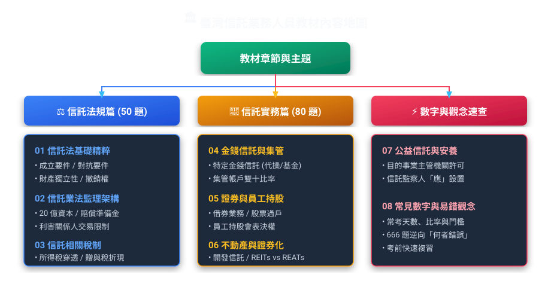

# 臺灣信託業務人員專業測驗：生活圖解重點教材

> **編撰依據**：依據中華民國現行《信託法》、《信託業法》、《不動產證券化條例》、《金融資產證券化條例》、信託稅法及金管會最新函令，深度解析**第 41 期至第 62 期歷屆考古題（共 2,860 題）**之高頻出題邏輯。
> **核心特色**：
> 1. **大量視覺化圖表**：全模組採用 Mermaid 流程圖、架構圖、對照表，建立視覺化空間記憶。
> 2. **生活化白話比喻**：以日常故事與形象譬喻（如防彈衣、防火牆、水管穿透）拆解晦澀法條。
> 3. **保留法規原意與嚴謹度**：標明條號、法定要件、例外規定，絕不因白話化而失真。
> 4. **考古題高頻考點直擊**：精準標註「何者錯誤」逆向題陷阱、必背關鍵字與歷屆常考陷阱。

---

## 📚 教材模組目錄地圖

<!-- topic-statistics:start -->

---

## 📊 歷屆出題知識點統計

統計範圍：**第 41–62 期｜2,726 題、73 個知識點**。依 c01–c07 完整題庫的知識點分類計算，每筆來源題計一次；不同期別的相同題目仍各計一次。第 08 章為跨章速查切片，不重複納入。

> 教材前言的 2,860 題是歷屆原始總量；以下圖表以目前 c01–c07 已收錄且分類的 **2,726 題**為準。出題次數僅反映本站收錄題目，不代表未來配分。

### 全題庫高頻知識點 TOP 15

<section class="topic-stat-chart" aria-label="全題庫高頻知識點 TOP 15">
全題庫高頻知識點 TOP 15

第 41–62 期｜2,726 題｜占比以全題庫為分母
<ol class="topic-stat-list"><li class="topic-stat-row">1境外基金與國外證券投資230 題8.4%</li><li class="topic-stat-row">2成立方式與信託分類154 題5.6%</li><li class="topic-stat-row">3基金保管交割與監督責任142 題5.2%</li><li class="topic-stat-row">4業務範圍與禁止保本保息116 題4.3%</li><li class="topic-stat-row">5金錢信託分類權限與運用112 題4.1%</li><li class="topic-stat-row">6全權委託保管與越權交易100 題3.7%</li><li class="topic-stat-row">7特殊目的信託公司與參與機構89 題3.3%</li><li class="topic-stat-row">8REIT募集投資標的與限制87 題3.2%</li><li class="topic-stat-row">9員工福利信託特性與制度69 題2.5%</li><li class="topic-stat-row">10受託人義務報酬與責任61 題2.2%</li><li class="topic-stat-row">11持股會組織協議與當事人59 題2.2%</li><li class="topic-stat-row">12財產評審報告與會計公告59 題2.2%</li><li class="topic-stat-row">13單獨及集合管理分類與權限59 題2.2%</li><li class="topic-stat-row">14所得稅與扣繳55 題2.0%</li><li class="topic-stat-row">15證券信託種類與保管差異51 題1.9%</li></ol>
橫條以本圖最高題數為比較基準；占比以 2,726 題為分母。
</section>

### 各章完整知識點分布

展開各章可查看全部知識點。圖表隨螢幕寬度調整，手機可直接閱讀完整名稱、題數與占比。各章百分比以該章收錄題數為分母。

🛡️ 信託法基礎與獨立性｜455 題

<section class="topic-stat-chart" aria-label="信託法基礎與獨立性：出題知識點">
信託法基礎與獨立性：出題知識點

第 41–62 期｜本章 455 題｜10 個知識點
<ol class="topic-stat-list"><li class="topic-stat-row">1成立方式與信託分類154 題33.8%</li><li class="topic-stat-row">2受託人義務報酬與責任61 題13.4%</li><li class="topic-stat-row">3公益信託與監督機關46 題10.1%</li><li class="topic-stat-row">4登記公示與對抗效力33 題7.3%</li><li class="topic-stat-row">5委託人權利與信託標的30 題6.6%</li><li class="topic-stat-row">6終止變更與剩餘財產歸屬30 題6.6%</li><li class="topic-stat-row">7受益人權利與撤銷救濟29 題6.4%</li><li class="topic-stat-row">8信託監察人26 題5.7%</li><li class="topic-stat-row">9財產獨立性與強制執行26 題5.7%</li><li class="topic-stat-row">10設立能力與監督管轄20 題4.4%</li></ol>
橫條以本圖最高題數為比較基準；占比以 455 題為分母。
</section>

🏢 信託業法與監理架構｜568 題

<section class="topic-stat-chart" aria-label="信託業法與監理架構：出題知識點">
信託業法與監理架構：出題知識點

第 41–62 期｜本章 568 題｜19 個知識點
<ol class="topic-stat-list"><li class="topic-stat-row">1業務範圍與禁止保本保息116 題20.4%</li><li class="topic-stat-row">2財產評審報告與會計公告59 題10.4%</li><li class="topic-stat-row">3經營組織與兼營獨立50 題8.8%</li><li class="topic-stat-row">4設立標準與分支機構47 題8.3%</li><li class="topic-stat-row">5監理處分罰則與損害賠償45 題7.9%</li><li class="topic-stat-row">6利害關係人與利益衝突43 題7.6%</li><li class="topic-stat-row">7賠償準備金與盈餘分配33 題5.8%</li><li class="topic-stat-row">8基本義務與契約記載事項28 題4.9%</li><li class="topic-stat-row">9共同信託基金募集與運用26 題4.6%</li><li class="topic-stat-row">10客戶認識商品適合度與投資人分類25 題4.4%</li><li class="topic-stat-row">11行銷訂約與風險揭露24 題4.2%</li><li class="topic-stat-row">12人員資格訓練與利益限制23 題4.0%</li><li class="topic-stat-row">13內控稽核與風險管理21 題3.7%</li><li class="topic-stat-row">14公會自律與行為規範16 題2.8%</li><li class="topic-stat-row">15評審委員會與內部職責7 題1.2%</li><li class="topic-stat-row">16特定指定不指定信託分類2 題0.4%</li><li class="topic-stat-row">17自有財產運用限制1 題0.2%</li><li class="topic-stat-row">18信用評等與機構資格綜合比較1 題0.2%</li><li class="topic-stat-row">19業務種類與交付財產分類1 題0.2%</li></ol>
橫條以本圖最高題數為比較基準；占比以 568 題為分母。
</section>

💧 信託稅制全攻略穿透篇｜179 題

<section class="topic-stat-chart" aria-label="信託稅制全攻略穿透篇：出題知識點">
信託稅制全攻略穿透篇：出題知識點

第 41–62 期｜本章 179 題｜11 個知識點
<ol class="topic-stat-list"><li class="topic-stat-row">1所得稅與扣繳55 題30.7%</li><li class="topic-stat-row">2信託課稅原則與形式移轉22 題12.3%</li><li class="topic-stat-row">3遺產及贈與稅21 題11.7%</li><li class="topic-stat-row">4土地稅與土地增值稅19 題10.6%</li><li class="topic-stat-row">5房屋稅與契稅12 題6.7%</li><li class="topic-stat-row">6員工持股信託的課稅與返還12 題6.7%</li><li class="topic-stat-row">7贈與權利價值與折現計算10 題5.6%</li><li class="topic-stat-row">8證券化商品分離課稅與交易稅9 題5.0%</li><li class="topic-stat-row">9營業稅與印花稅8 題4.5%</li><li class="topic-stat-row">10證券交易稅8 題4.5%</li><li class="topic-stat-row">11信託稅務綜合比較3 題1.7%</li></ol>
橫條以本圖最高題數為比較基準；占比以 179 題為分母。
</section>

🌊 金錢信託與集合管理｜565 題

<section class="topic-stat-chart" aria-label="金錢信託與集合管理：出題知識點">
金錢信託與集合管理：出題知識點

第 41–62 期｜本章 565 題｜9 個知識點
<ol class="topic-stat-list"><li class="topic-stat-row">1境外基金與國外證券投資230 題40.7%</li><li class="topic-stat-row">2金錢信託分類權限與運用112 題19.8%</li><li class="topic-stat-row">3員工福利信託特性與制度69 題12.2%</li><li class="topic-stat-row">4持股會組織協議與當事人59 題10.4%</li><li class="topic-stat-row">5投資運用與分別管理39 題6.9%</li><li class="topic-stat-row">6外匯結匯與國際金融業務22 題3.9%</li><li class="topic-stat-row">7結構型商品與衍生性金融商品14 題2.5%</li><li class="topic-stat-row">8退出終止與財產返還10 題1.8%</li><li class="topic-stat-row">9資金提撥與公司獎勵10 題1.8%</li></ol>
橫條以本圖最高題數為比較基準；占比以 565 題為分母。
</section>

📈 有價證券與員工福利信託｜133 題

<section class="topic-stat-chart" aria-label="有價證券與員工福利信託：出題知識點">
有價證券與員工福利信託：出題知識點

第 41–62 期｜本章 133 題｜3 個知識點
<ol class="topic-stat-list"><li class="topic-stat-row">1證券信託種類與保管差異51 題38.3%</li><li class="topic-stat-row">2有價證券借貸交易與擔保44 題33.1%</li><li class="topic-stat-row">3內部人持股申報與權益行使38 題28.6%</li></ol>
橫條以本圖最高題數為比較基準；占比以 133 題為分母。
</section>

🏗️ 不動產信託與資產證券化｜353 題

<section class="topic-stat-chart" aria-label="不動產信託與資產證券化：出題知識點">
不動產信託與資產證券化：出題知識點

第 41–62 期｜本章 353 題｜10 個知識點
<ol class="topic-stat-list"><li class="topic-stat-row">1特殊目的信託公司與參與機構89 題25.2%</li><li class="topic-stat-row">2REIT募集投資標的與限制87 題24.6%</li><li class="topic-stat-row">3不動產證券化共通規定49 題13.9%</li><li class="topic-stat-row">4受益證券募集發行與受益人會議26 題7.4%</li><li class="topic-stat-row">5證券化特性與經濟效益26 題7.4%</li><li class="topic-stat-row">6土地開發與不動產管理信託21 題5.9%</li><li class="topic-stat-row">7資產移轉債權與債務人通知18 題5.1%</li><li class="topic-stat-row">8信用增強評等與風險分散15 題4.2%</li><li class="topic-stat-row">9REAT資產信託與證券發行14 題4.0%</li><li class="topic-stat-row">10證券化計畫與其他制度8 題2.3%</li></ol>
橫條以本圖最高題數為比較基準；占比以 353 題為分母。
</section>

🏛️ 公益信託與基金安養照護｜473 題

<section class="topic-stat-chart" aria-label="公益信託與基金安養照護：出題知識點">
公益信託與基金安養照護：出題知識點

第 41–62 期｜本章 473 題｜11 個知識點
<ol class="topic-stat-list"><li class="topic-stat-row">1基金保管交割與監督責任142 題30.0%</li><li class="topic-stat-row">2全權委託保管與越權交易100 題21.1%</li><li class="topic-stat-row">3單獨及集合管理分類與權限59 題12.5%</li><li class="topic-stat-row">4集合帳戶投資限制與流動性50 題10.6%</li><li class="topic-stat-row">5集合帳戶申請設置與合併34 題7.2%</li><li class="topic-stat-row">6外資全球保管與代理登記29 題6.1%</li><li class="topic-stat-row">7預收款禮券與履約保障24 題5.1%</li><li class="topic-stat-row">8其他資產保管與營業保證金20 題4.2%</li><li class="topic-stat-row">9集合帳戶受益權淨值與退出9 題1.9%</li><li class="topic-stat-row">10安養退休與保險金信託4 題0.8%</li><li class="topic-stat-row">11子女教育與保險信託應用2 題0.4%</li></ol>
橫條以本圖最高題數為比較基準；占比以 473 題為分母。
</section>

<!-- topic-statistics:end -->
