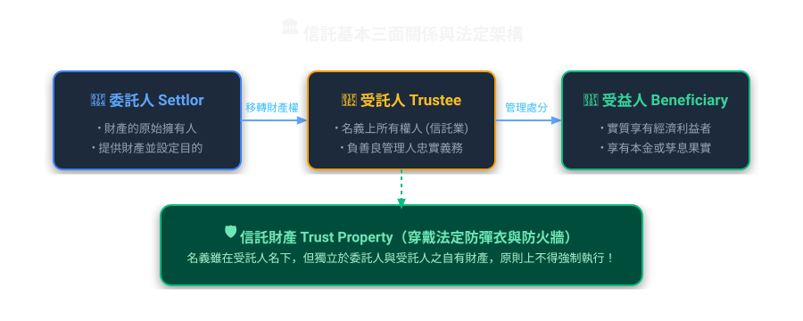
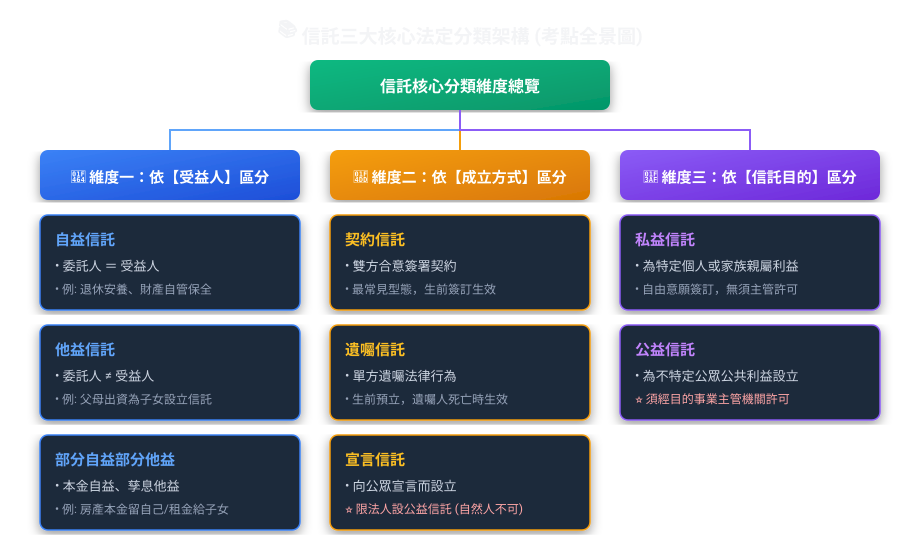
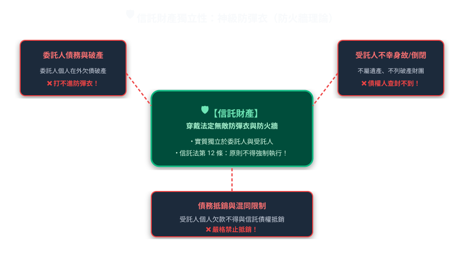
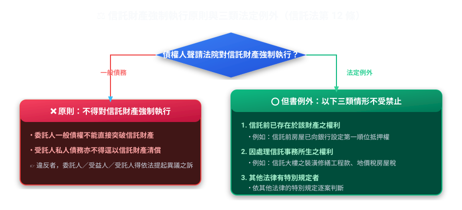
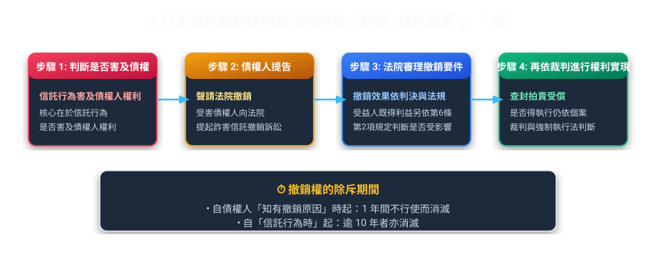
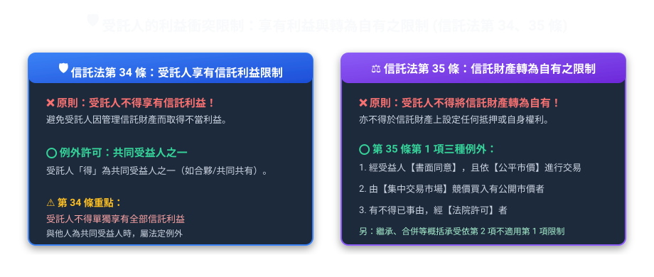
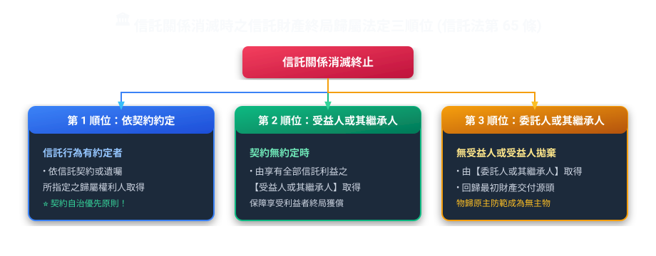

# 第 01 章：信託法基礎與信託財產獨立性（生活圖解篇）

---

## 🎯 本章重點

依本站歷屆題庫整理，信託財產獨立性（第 12 條）、公示與對抗要件（第 4 條）、詐害信託撤銷權（第 6、7 條）及受託人義務（第 22～35 條）都是高頻考點。本章以下內容以現行《信託法》條文為準。

---

## 💡 一、信託的本質與生活化白話比喻

### 1. 什麼是信託？（信託法第 1 條）
> **法條原意**：稱信託者，謂委託人將財產權移轉或為其他處分，使受託人依信託本旨，為受益人之利益或為特定之目的，管理或處分信託財產之關係。

*   **實務情境（高齡安養與二代教育金傳承信託）**：
    王老先生（**委託人**）把 1,000 萬元交給臺灣銀行信託部（**受託人**），並在契約中寫明兩筆用途：銀行每月從信託財產支付 3 萬元給王老先生作生活費（**自益部分**）；孫子小明上大學後，每學期支付 10 萬元作學雜費（**他益部分**）。
    *   ① **財產權移轉**：這筆錢已交付信託。王老先生日後欠下一般債務，債權人原則上不能直接對信託財產強制執行；仍要檢查《信託法》第 12 條的例外。
    *   ② **分別管理義務**：銀行須把這筆信託資金與自己的資產分開記帳、管理。
    *   ③ **稅務效果**：小明取得他益信託利益時，須再判斷是否構成《遺產及贈與稅法》的視同贈與，以及如何申報、估價。
*   **四大核心構成要件**：
    1.  **委託人須移轉財產權或為其他處分**：例如把資金交付信託。若只是請人代辦事情，沒有把財產權移轉或處分，就不能僅憑「請你幫我管」四個字認定信託成立；仍須依實際法律關係判斷。
    2.  **必須有「信託目的」**：目的必須合法、可能、確定，且不能違反公共秩序與善良風俗。
    3.  **受託人是「為受益人利益」或「特定目的」而管理**：不是為受託人自己賺錢。
    4.  **信託財產必須具體確定**：不能是抽象概念（例如不能以「未來可能發生的好運」為信託財產）。

---

## 🛡️ 二、信託怎麼分類？先看受益人、成立方式與目的

> **常見的錯誤說法**：
> *   **說法 1**：自然人可以用「宣言信託」設立信託？
>     *   👉 **錯誤。**《信託法》第 71 條的宣言信託，是法人為增進公共利益，經決議並取得目的事業主管機關許可後，對外宣言自為委託人及受託人。自然人不適用此一宣言信託制度。
> *   **說法 2**：「法定信託」是《信託法》列出的設立方式嗎？
>     *   👉 **不是。**我國《信託法》列的是契約、遺囑，以及符合法定條件的宣言信託；不要把其他法系所稱的「法定信託」當成這裡的第四種設立方式。

---

## 🔰 三、信託財產的獨立性

信託財產移轉或處分予受託人後，法律賦予其獨立性；它不因受託人死亡或破產而成為受託人的遺產或破產財團，且原則上不得任意強制執行。

### 1. 信託財產獨立性的五項核心規則（信託法第 9～14 條）
1.  **物上代位性（第 9 條，換形不換質）**：信託財產因管理、處分、滅失、毀損取得之賠償金、保險給付或變賣價金，仍屬信託財產。即使型態由房屋轉為現金，也不因此成為受託人自有財產；是否得強制執行仍依第 12 條及其他法律判斷。
2.  **不屬於受託人之遺產（第 10 條）**：受託人死亡時，信託財產由新受託人接手，**不列入受託人的遺產**！
3.  **不屬於受託人之破產財團（第 11 條）**：受託人個人經商失敗宣布破產，信託財產**不屬於受託人的破產財團**。
4.  **禁止強制執行之原則（第 12 條第 1 項）**：任何人不得隨意對信託財產聲請法院查封拍賣。
5.  **禁止抵銷（第 13 條）**：老王欠受託人個人 100 萬，但老王對信託財產有 100 萬債權，**兩者不得主張抵銷**！

---

### 🚨 2. 原則不得強制執行，但有三類例外

讀到「債權人要查封信託財產」，先用《信託法》第 12 條第 1 項判斷：原則上不得強制執行，再看但書的三類例外。本站題庫曾多次考這個原則與例外的分界。

> **🔥 審題重點**：
> *   委託人的普通債權人拿本票裁定，要去查封信託財產？ ❌ **不可以！違反第 12 條！**
> *   銀行在房子信託前，就已經設定了第一順位最高限額抵押權，委託人違約不繳房貸，銀行可否拍賣信託房屋？ ⭕ **可以！此為「信託前已存在之權利」！**
> *   受託人請水電師傅修繕信託的公寓水管，修繕完畢積欠工程款 10 萬元，水電師傅可否向法院聲請對信託公寓強制執行？ ⭕ **可以！此為「因處理信託事務所生之權利」！**

---

## 🪪 四、信託公示制度：對抗要件（信託法第 4 條）

雙方簽好信託契約，還不代表能用這份契約對抗所有第三人。例如房屋已交付信託，對外仍須依《信託法》第 4 條辦理信託登記；這就是**公示**，目的是讓第三人能辨認財產的信託性質。

| 財產類型 | 公示與生效規定 | 未登記之法律效果 |
| :--- | :--- | :--- |
| **應登記之財產權** （如：土地、房屋、船舶、航空器、商標權、專利權） | 必須向地政機關或主管機關辦妥**信託登記** | **法定對抗要件而非成立要件**！信託契約在委託人與受託人間債權仍合法有效，但**對外喪失阻擋第三人強制執行之對抗力**（如盾牌未舉起，第三人仍得拍賣取償） |
| **有價證券** | 依目的事業主管機關規定，在證券或其他表彰權利文件上**載明為信託財產**；股票或公司債券另須**通知發行公司** | 未依法載明為信託財產，**不得對抗第三人**；股票或公司債券未通知發行公司，**不得對抗發行公司** |

> **例子：土地漏辦信託登記**
> 陳先生將一筆市價 5,000 萬元的土地信託移轉給張先生管理。雙方已簽訂信託契約，也辦了所有權移轉登記，卻漏辦「信託登記（未載明為信託財產及信託專簿）」：
> ① **內部關係**：未辦信託登記，不代表信託當然無效；委託人與受託人間的權利義務仍須依信託行為及一般法律關係判斷。
> ② **外部關係**：依第 4 條，未辦理信託登記即不得以該信託對抗第三人；至於個案能否強制執行，仍應依第三人的權利、執行名義及其他相關法規判斷。
> 📌 **判斷順序**：先看信託在當事人間是否成立，再看有沒有完成登記，能否對抗第三人。

> **常見錯誤（第 41 期第 1 題）**：
> *   題目：「以股票為信託者，通知發行公司即可對抗第三人？」
> *   👉 **錯！**「載明為信託財產」是對抗第三人的要件；股票或公司債券另須通知發行公司，才能對抗該公司。兩種對抗對象不要混為一談。

---

## ⚔️ 五、債務人用信託減少財產時：詐害信託與撤銷權（信託法第 6、7 條）

【建商欠款脫產信託與除斥期間之防禦】
包商黃董積欠下游材料商林老闆 3,000 萬元工程款，為免豪宅被查封，將名下價值 4,000 萬元的豪宅信託登記給不知情的胞弟作為子女教育基金：
① **有害及債權**：黃董信託行為導致其剩餘資產不足清償債務，構成有害及債權；
② **撤銷與受益人既得利益要分開判斷**：信託行為有害於債權人權利時，債權人得聲請法院撤銷；但受益人已取得的利益原則上不受撤銷影響，除非利益尚未屆清償期，或受益人取得利益時明知或可得而知有害及債權。
③ **嚴格除斥期間**：林老闆必須在「自知有撤銷原因起 1 年內」，或「自信託行為成立日起 10 年內」，向民事法院提起撤銷訴訟；逾期則撤銷權消滅！

### 1. 撤銷的法定條件
1.  **有害於債權人**：信託行為發生時，委託人之資產已經不足以清償所有既有債務（害及資力）。
2.  **撤銷要件著重信託行為是否有害債權**：第 6 條並未把受託人惡意列為撤銷要件；但受益人已取得利益能否保有，仍須依第 6 條第 2 項判斷。
3.  **法定推定有害（第 6 條第 3 項）**：信託成立後 **6 個月內**，委託人被宣告破產者，**法律直接推定該信託行為有害於債權**！

### 2. 撤銷權的除斥期間
*   **短期間**：自債權人**知有撤銷原因起，1 年間**不行使而消滅。
*   **長期間**：自信託行為**成立日起，逾 10 年**不行使而消滅。

---

## 🧑‍💼 六、受託人的權利、義務與利益衝突迴避

受託人是在管理別人的財產，所以不能只憑自己方便行事。《信託法》要求他依信託目的管理、原則上親自處理信託事務，並把不同財產分開管理。

### 1. 受託人的三項核心義務
1.  **善良管理人之注意義務（信託法第 22 條）**：
    **善良管理人之注意義務**，就是處理信託事務時，要有法律要求的謹慎程度，不能因為「沒收報酬」就隨便做。依第 22 條，即使是**無償受託人**，仍應依信託本旨負此注意義務；不要直接套用民法無償委任的注意標準。
2.  **親自處理義務（第 25 條）**：
    受託人原則上**應親自處理信託事務**。
    *   **得使第三人代為處理的法定例外只有兩類**：
        1. 信託行為另有訂定。
        2. 有不得已之事由。
    *   單純取得委託人及受益人同意，並不是第 25 條明文列出的第三種例外。
3.  **分別管理義務（第 24 條）**：
    受託人必須將信託財產與其**自有財產**，以及**不同信託之信託財產**，分別獨立管理。

---

### 2. 利益衝突迴避（信託法第 34、35 條）

> **常見考法**：
> *   問：受託人可否同時為該信託之唯一受益人？
>     *   👉 **不可以。**第 34 條規定受託人不得享有信託利益，但與他人為共同受益人者例外，因此受託人不能成為唯一受益人。
> *   問：受託人看中信託財產中的不動產或名車，想將信託財產轉為自有財產（自易交易），法律如何規範？
>     *   👉 **原則禁止，但有法定例外。**第 35 條第 1 項列出三種例外：① 經受益人書面同意並依市價取得；② 由集中市場競價取得；③ 有不得已事由經法院許可。另依第 2 項，受託人因繼承、合併或其他事由概括承受信託財產上權利時，也不適用第 1 項限制。

---

## 🔚 七、信託之消滅與賸餘財產歸屬（信託法第 62~65 條）

信託關係因為信託目的已完成、不能完成、期限屆滿、或終止而消滅時，剩下的財產該給誰？

> **歸屬順序**：
> **「一約定、二全部受益、三委託」**：信託行為有約定歸屬權利人時依約定；未約定時，先歸屬於**享有全部信託利益之受益人**，其次才是委託人或其繼承人。

---

## 📜 法規原文對照庫

  
📜 查閱中華民國《信託法》關鍵法定條文原文

  

    
<strong>第 1 條（信託定義）</strong>：稱信託者，謂委託人將財產權移轉或為其他處分，使受託人依信託本旨，為受益人之利益或為特定之目的，管理或處分信託財產之關係。

    
<strong>第 4 條（公示與對抗要件）</strong>：應登記或註冊之財產權，非經信託登記不得對抗第三人；有價證券未依法載明為信託財產，不得對抗第三人；股票或公司債券另須通知發行公司，否則不得對抗該公司。

    
<strong>第 6 條（詐害信託撤銷權）</strong>：信託行為有害於委託人之債權人權利者，債權人得聲請法院撤銷；受益人已取得利益的保護另依第 2 項判斷。信託成立後 6 個月內，委託人或其遺產受破產宣告者，推定其行為有害及債權。

    
<strong>第 7 條（撤銷權除斥期間）</strong>：前條撤銷權，自債權人知有撤銷原因時起，1 年間不行使而消滅。自信託行為成立時起，逾 10 年者，亦同。

    
<strong>第 12 條（強制執行禁止與例外）</strong>：對信託財產不得強制執行。但基於信託前已存在於該財產之權利、因處理信託事務所生之權利或其他法律有特別規定者，不在此限。

    
<strong>第 34 條（受託人利益限制）</strong>：受託人不得以任何名義，享有信託利益。但與他人為共同受益人時，不在此限。

    
<strong>第 35 條（轉為自有之限制）</strong>：受託人原則上不得將信託財產轉為自有財產或於其上設定、取得權利；第 1 項列有受益人書面同意並依市價取得、集中市場競價取得、不得已事由經法院許可三種例外，第 2 項另定繼承、合併或其他概括承受的例外。

  

