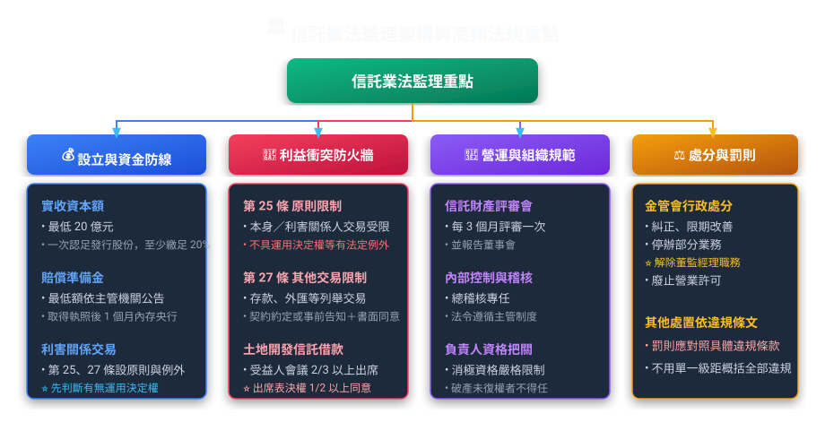
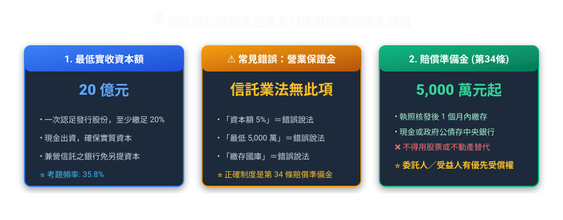
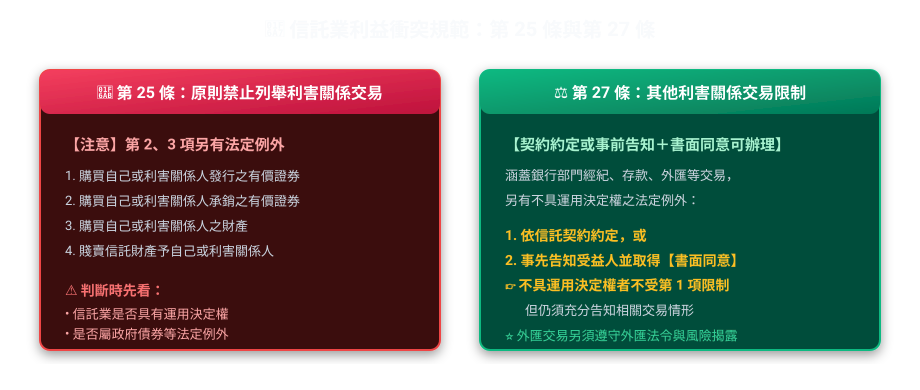
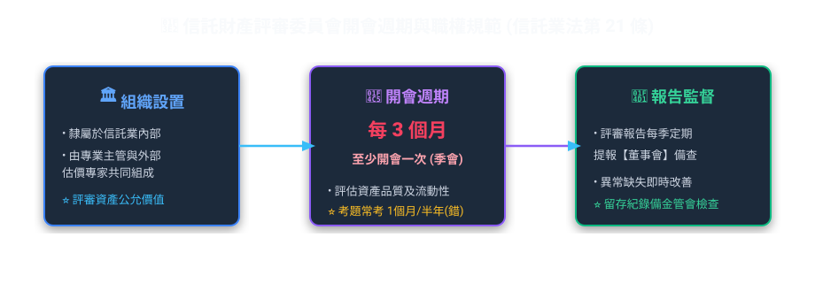
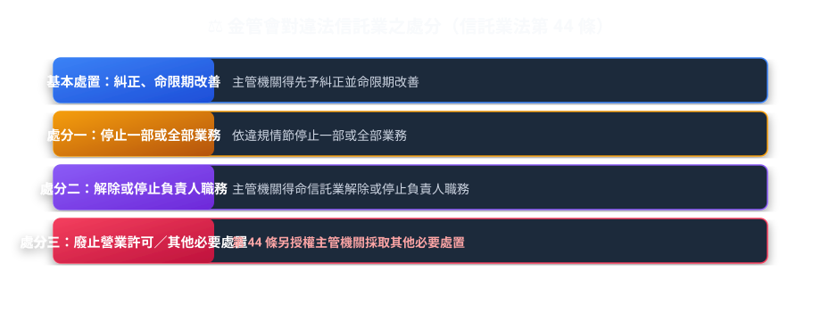

# 第 02 章：信託業法與金融監理架構（圖解篇）

---

## 🎯 本章學習導航與核心地圖

依本站歷屆題庫整理，《信託業法》的監理架構、利益衝突、賠償準備金與信託財產評審制度都是高頻考點。
本章核心在於金管會如何透過「資金門檻」、「防火牆制度」與「內部控制」來監管這群管錢的金融機構。

---

## 🏢 一、信託業的誕生：設立門檻與兩道資金防線

要開辦信託業務，法律採「特許營業許可制與業務分別核定原則」：
① **業務核定原則**：信託業得經營的業務種類，應依第 18 條報請主管機關核定；涉及外匯業務者，應經中央銀行同意。
② **不得承諾保本或最低收益率（第 31 條）**：信託業不得承諾擔保本金或最低收益率。底層商品本身如另有發行條件，仍應區分商品發行人的義務與受託人的責任，不可把商品條件解讀成信託業對客戶的保證。

### 1. 兩大資金門檻精準比對表（考題必出數字！）

| 項目 | 法定金額 / 比率 | 繳存地點 / 形式 | 主要功能與受償權利 |
| :--- | :--- | :--- | :--- |
| **最低實收資本額** | **新臺幣 20 億元** （發起人一次認足發行股份總額，並至少繳足 20% 股款） | 信託公司自有資本 | 確保公司資本充足度與營運穩定性 |
| **賠償準備金** （信託業法第 34 條） | **最低 5,000 萬元**，並依主管機關公告按受託財產計提 | 取得執照後 **1 個月內** 以**現金或政府債券**繳存**中央銀行** | 擔保信託業因違反受託人義務所負的**損害賠償、利益返還或其他責任**；委託人或受益人對賠償準備金有**優先受償權** |

> **🔥 考古題必考陷阱（何者錯誤）**：
> *   **陷阱 1**：信託業法要求信託業另提「營業保證金」，例如實收資本額 5%、最低 5,000 萬元並繳存國庫？ ❌ **錯誤！信託業法本身沒有這項營業保證金要求；正確制度是第 34 條的「賠償準備金」，繳存中央銀行。**
> *   **陷阱 2**：賠償準備金繳存於財政部？ ❌ **錯誤！是繳存「中央銀行」！**
> *   **陷阱 3**：賠償準備金得以股票或不動產繳存？ ❌ **錯誤！限以「現金」或「政府債券」繳存！**
> *   **陷阱 4**：賠償準備金只是一般營運資金？ ❌ **錯誤。**第 34 條明定其用於擔保違反受託人義務所生責任，且委託人或受益人有優先受償權。

---

## 🚧 二、利益衝突防護網：信託業法第 25 條與第 27 條

信託業是管錢的人，最怕經理人「內線交易」或把親戚快倒閉公司的爛股票賣給客戶的信託帳戶！

### 1. 信託業的「利害關係人」是誰？（信託業法第 7 條）
記憶關鍵數字：**「持股 5%」與「持股 10%」**！
*   持有信託公司股份總額 **5% 以上**之股東。
*   信託業負責人（董、監、總經理）。
*   信託業負責人獨資、合夥，或持股超過 **10%** 之企業。
*   信託公司持股超過 **5%** 之轉投資企業。
*   對信託財產具有**運用決定權之人**。

### 2. 第 25 條與第 27 條的限制及例外

| 比較維度 | 第 25 條 | 第 27 條 |
| :--- | :--- | :--- |
| **基本規則** | 原則禁止以信託財產與本身或利害關係人從事第 25 條列舉交易 | 原則禁止第 27 條列舉交易，但信託契約有約定，或事先告知受益人並取得書面同意時，得依規定辦理 |
| **規範範圍** | 1. 購買本身或利害關係人發行或承銷之有價證券或票券。 2. 購買本身或利害關係人之財產。 3. 讓售予本身或利害關係人。 4. 其他主管機關規定之利害關係交易。 | 1. 購買其銀行業務部門經紀之有價證券或票券。 2. 存放於其銀行業務部門或利害關係人處，或與銀行業務部門從事外匯相關交易。 3. 與本身或利害關係人為第 25 條第 1 項以外之其他交易。 |
| **重要例外** | 信託契約約定信託業對信託財產**不具運用決定權**者，不受第 1 項限制，但須充分告知交易情形；**政府發行之債券**亦不受第 1 項限制。 | 信託契約約定信託業對信託財產**不具運用決定權**者，不受第 1 項限制，但仍須充分告知交易情形；外匯交易並須遵守外匯法令及揭露風險。 |

---

## 🏛️ 三、公司治理：信託財產評審委員會

信託業管理這麼多龐大資產，資產到底值多少錢？有沒有跌價風險？需要專門委員會審核：

*   **評審頻率**：第 21 條規定信託財產**每 3 個月評審一次**，並報告董事會。
*   **職責**：審查受託財產之評審原則、公允價格認定及後續風險控管，並將結果提報董事會。

### 2. 信託業的法定定期報告
*   **信託財產評審**：第 21 條明定每 **3 個月評審一次**，並報告董事會；條文本身沒有「季後 1 個月內」的額外期限。
*   **營業報告與財務報告**：第 39 條規定信託業應於**每半營業年度**編製營業報告書及財務報告，向主管機關申報，並公告資產負債表；具體期限見《信託業法施行細則》第 17 條：**半年度終了後 2 個月內**、**年度終了後 4 個月內**辦理。

---

## ⚖️ 四、監理處分與罰則體系

當信託業違反法令或章程、有損害受益人權益之虞時，主管機關（金融監督管理委員會）有哪些大招？

> **🔥 歷屆經典試題（解任董監職務）**：
> *   題目：信託業董事或監察人違反法令時，信託業商業同業公會得否直接解除其職務？
> *   👉 **錯！** 同業公會無此行政權力，**只有主管機關（金管會）**有權命令解除其董監職務！

---

## 📜 法規原文對照庫

  
📜 查閱中華民國《信託業法》關鍵法定條文原文

  

    
<strong>設立資本額</strong>：信託業法第 10 條授權主管機關訂定最低實收資本額；依《信託業設立標準》第 3、4 條，一般信託公司最低實收資本額為新臺幣 20 億元，發起人應一次認足發行股份總額，並至少繳足 20% 股款。

    
<strong>第 25 條（利害關係交易限制）</strong>：原則禁止以信託財產從事條文列舉的本身或利害關係人交易；但信託契約約定信託業不具運用決定權者不受第 1 項限制，政府發行之債券亦屬法定例外。

    
<strong>第 27 條（其他利害關係交易限制）</strong>：除依信託契約約定，或事先告知受益人並取得書面同意外，不得從事條文列舉的交易；信託業不具運用決定權者不受第 1 項限制，但須充分告知交易情形。

    
<strong>第 34 條（賠償準備金）</strong>：信託業為擔保因違反受託人義務所負的損害賠償、利益返還或其他責任，應提存賠償準備金；取得營業執照後 1 個月內，以現金或政府債券繳存中央銀行。委託人或受益人有優先受償之權。

    
<strong>第 39 條＋施行細則第 17 條（定期報告）</strong>：信託業應於每半營業年度編製營業報告書及財務報告並向主管機關申報；半年度終了後 2 個月內、年度終了後 4 個月內辦理。

    
<strong>第 44 條（主管機關處分權限）</strong>：信託業違反法令或章程時，主管機關得依法律規定採取糾正、限期改善、停止部分業務或其他監理處分。

  

