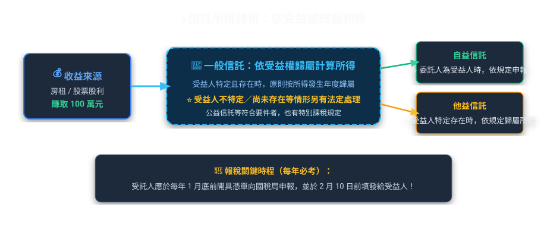
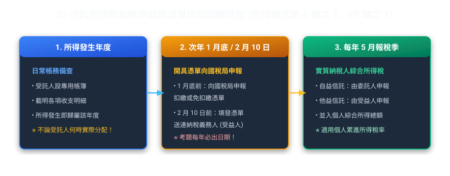
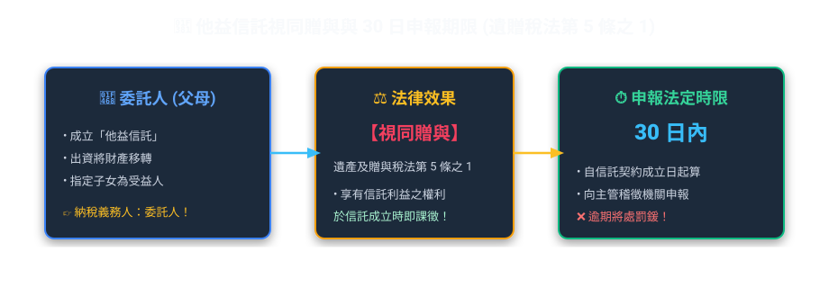
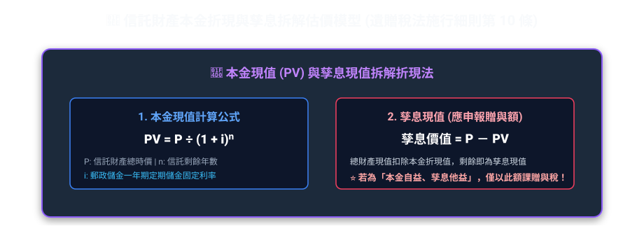
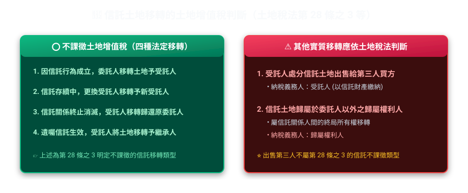

# 第 03 章：信託相關稅制全攻略（導管課稅圖解篇）

---

## 🎯 本章學習導航與核心地圖

信託稅制的核心，是先判斷「所得或財產利益實際歸屬誰」，再依各稅法的信託專章處理。本章以現行所得稅法、遺產及贈與稅法及地方稅規定整理；「導管課稅」是重要原則，但不是所有信託、所有所得都完全採同一處理。

---

## 💧 一、所得稅：以受益歸屬為核心的導管課稅

### 1. 什麼是「管道穿透理論」？
*   **白話生活比喻**：
    一般信託可把信託專戶想成「導管」：受託人依所得類別計算信託財產收入，再依受益權歸屬分配給受益人課稅。但所得稅法第 3 條之 4 對受益人不特定、尚未存在，以及符合要件的公益信託等另有規定，因此不能把「全部信託一律穿透」當成絕對規則。
*   **課稅時點：所得發生年度即時穿透課稅（導管原則）**
    對受益人已特定且存在的一般信託，受託人原則上按所得發生年度計算所得，並依受益比例歸屬受益人；實際何時把現金撥付出去，不是唯一判斷標準。
    *   **黃金案例**：老張將大樓信託出租，約定租金孳息全贈與兒子小張（他益信託）。113 年度產生租賃所得 240 萬元，雖然合約約定「累積至 115 年小張出國時整筆撥付」，但依所得稅法規定，這 240 萬元「必須在 113 年度即時穿透」歸課小張綜合所得稅！受託銀行必須於次年 1 月底前向國稅局申報信託所得憑單。

### 2. 所得稅納稅義務人判斷三部曲

| 信託形態 | 誰來繳納所得稅？ | 計算與申報方式 |
| :--- | :--- | :--- |
| **自益信託** （委託人 = 受益人） | **委託人** | 併入委託人當年度個人綜合所得總額申報 |
| **他益信託** （特定且確定之受益人） | **受益人** | 併入受益人當年度個人綜合所得總額申報 |
| **受益人不特定** 或**尚未存在**者 | **受託人** | 由受託人就信託所得依所得稅法第 3 條之 4 規定申報納稅；適用稅率與計算方式依所得種類及相關扣繳規定辦理，不宜概括寫成「一律按最高級距」 |

> **🔥 考古題必考報稅日程（必背數字）**：
> *   受託人應於每年 **1 月底前**，將上一年度信託財產目錄、收支計算表及扣繳憑單向稽徵機關申報，並於 **2 月 10 日前**填發給受益人。
> *   遇連續三天以上國定假日（如農曆春節），申報期間順延至 **2 月 5 日**，填發期限延長至 **2 月 15 日**。

---

## 🎁 二、贈與稅與遺產稅：視同贈與與折現計算

他益信託中，若信託契約約定全部或部分信託利益由委託人以外之人享有，原則上屬遺產及贈與稅法第 5 條之 1 所稱視同贈與；仍須注意公益信託等法定例外。

### 1. 贈與時點與申報期限
*   **贈與時點**：以**信託契約成立日**、或**變更他益受益人日**、或**追加信託財產日**為贈與行為發生日。
*   **申報期限**：依第 24 條及第 24 條之 1，若當年度贈與總額已達依法應申報的程度，應以訂定或變更信託契約日為贈與行為發生日，於法定 **30 日**期限內申報。並非每一筆他益信託都可脫離免稅額與其他法定條件，單獨用「成立後一律 30 日申報」概括。

### 2. 贈與價值計算公式（計算題高頻必考！）

當父母把 1,000 萬元信託，約定「期間 10 年，每年孳息給兒子，10 年期滿本金還給父母（**孳息他益、本金自益**）」，贈與金額該怎麼算？

> **🧮 實務精算案例【10年期本金他益信託之贈與稅折現】**：
> 郭董交付 1,000 萬元現金信託，期間 10 年，約定「每年租金利息全由郭董自領（自益），10 年期滿 1,000 萬本金歸兒子小郭（本金他益）」：
> ① 贈與標的係「10 年後才拿到的 1,000 萬元本金」，依法按成立時**中華郵政股份有限公司一年期定期儲金固定利率**（假設 2.0%）年複利折現：
>    *   **法定折現公式**：`現值 (PV) = 本金 ÷ (1 + 郵儲利率)ⁿ`
>    *   **本案數值試算**：`10,000,000 元 ÷ (1 + 0.02)¹⁰ ≈ 8,203,483 元`
> ② 郭董僅須以折現後的現值約 820.3 萬元申報贈與稅，大幅節省贈與稅基！

> **🔥 考古題必考關鍵字**：
> *   折現利率採用什麼利率？
>     *   👉 **「中華郵政股份有限公司一年期定期儲金固定利率」**（考題常故意寫成台灣銀行、中央銀行或活期存款利率來騙你！）。

---

## 🏞️ 三、土地稅：地價稅與土地增值稅

土地信託是信託業務最大宗之一，土增稅動輒上百萬，課不課稅是最大關鍵！

### 1. 土地增值稅之「四大不課徵」與「兩大課徵」

### 2. 受託人賣土地時，誰繳稅？原地價怎麼算？（考超多次！）
*   **納稅義務人**：以**受託人**為納稅義務人。
*   **原地價起算點**：不是以「信託過戶當日」的地價算，而是以**委託人當初取得該土地時之原地價**作為基期計算漲價總數額！防止有人想用信託洗地價規避土增稅！

### 3. 地價稅之課徵主體與歸戶方式
*   **納稅義務人**：信託關係存續中，原則以**受託人**為地價稅納稅義務人。
*   **歸戶計算不是一律按每一信託各自獨立**：土地稅法第 3 條之 1 對信託土地另定歸戶規則。一般情形會與**委託人在同一直轄市或縣（市）的土地合併計算地價總額**；如受益人已確定、享有全部信託利益，且委託人未保留變更受益人權利等法定條件成立，則依規定與受益人土地合併。

---

## 📜 四、契稅、營業稅與印花稅速記

| 稅目 | 委託人交付信託給受託人時 | 受託人返還委託人（自益信託）時 |
| :--- | :--- | :--- |
| **契稅** | 信託成立時，委託人與受託人間移轉信託房屋，**不課徵契稅** | 遺囑信託及契約明定受益人為委託人的自益信託，於信託消滅時返還，**不課徵契稅**；若依信託本旨移轉給委託人以外的歸屬權利人，則依規定課徵 |
| **營業稅** | 單純信託移轉本身不宜直接等同銷售；應看是否發生營業稅法上的「銷售貨物或勞務」 | 受託人管理或處分信託財產如實際發生銷售，除免稅項目外，應由受託人辦理稅籍、開立發票並報繳營業稅；將管理或處分收益交付受益人，則非受益人銷售貨物或勞務之代價 |
| **印花稅** | **自益信託**成立時據以辦理不動產權利變更登記，屬形式移轉，非典賣、讓受契據，**不課印花稅** | 自益信託消滅返還委託人，同樣屬形式移轉而不課；若**他益信託**依約移轉不動產給委託人以外之歸屬權利人，且契據持憑辦理登記，按規定以契約金額 **1‰** 課印花稅 |

> **💡 印花稅記憶點**：
> 不要用「只要辦登記就一定 1‰」判斷。自益信託成立、消滅的形式移轉，不屬印花稅法的典賣、讓受不動產契據；他益信託實質移轉給第三人歸屬權利人時，才要再判斷 1‰ 印花稅。

---

## 📜 法規原文對照庫

  
📜 查閱信託相關稅法關鍵條文原文（所得稅法、遺贈稅法、土地稅法）

  

    
<strong>所得稅法第 3 條之 4（導管穿透原則）</strong>：信託財產發生之收入，受託人應於所得發生年度，依所得稅法規定計算所得，並由受益人併入當年度所得額課徵所得稅。

    
<strong>所得稅法第 92 條之 1（信託申報與憑單時程）</strong>：受託人應於每年 1 月底前，依規定向稽徵機關申報上一年度信託所得相關資料，並於 2 月 10 日前將憑單填發納稅義務人；遇法定連續假期時依條文規定展延。

    
<strong>遺產及贈與稅法第 5 條之 1、第 24 條之 1</strong>：他益信託原則上視為委託人將信託利益權利贈與受益人；其贈與行為發生日以訂定、變更信託契約日認定，申報期限再依第 24 條是否達應申報條件判斷。

    
<strong>土地稅法第 28 條之 3（不課徵土地增值稅）</strong>：因信託行為成立、更換受託人、自益信託終止土地歸還委託人，或遺囑信託移轉予繼承人，不課徵土地增值稅。

  

