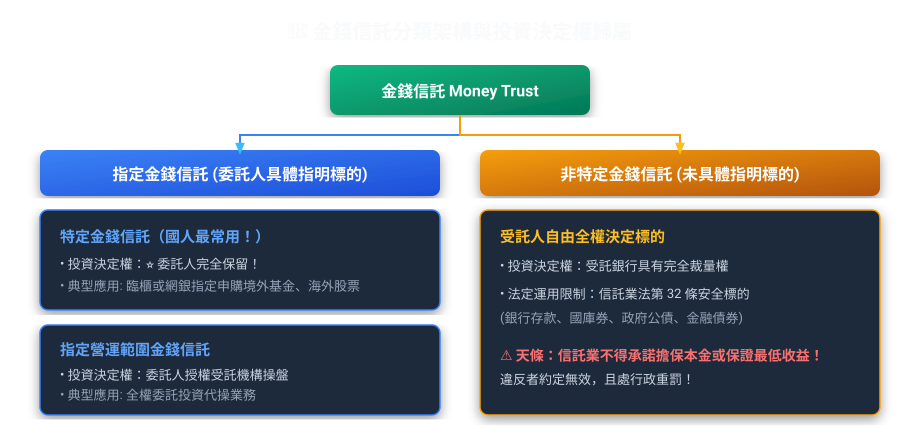
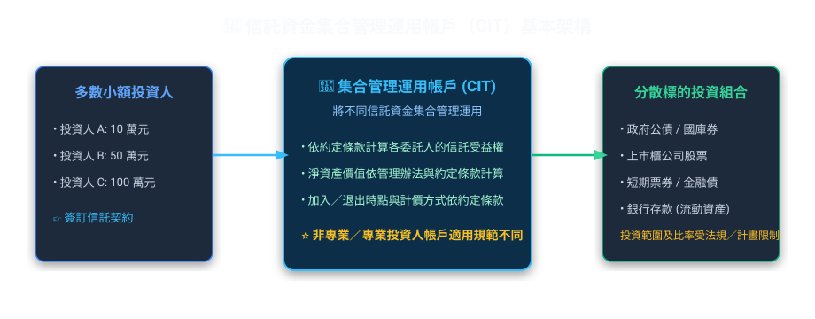
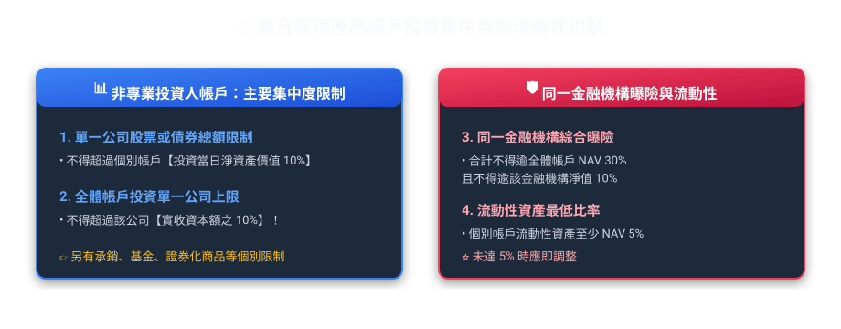

# 第 04 章：金錢信託與集合管理運用（實務篇）

---

## 🎯 本章學習導航與核心地圖

在信託實務考科（每期 80 題）中，「金錢信託與集合管理運用」出現頻率高達 **36.4%**（累計出題 641 次），是實務科目中**權重最高、題量最大**的核心樞紐！
掌握了「運用決定權在誰手裡」與「集合管理帳戶（集管帳戶）的投資規範」，實務科目就已經拿下一大半！

---

## 🧭 一、金錢信託分類架構與生活化比喻

### 1. 什麼是特定金錢信託 vs 非指定金錢信託？
*   **高傳真金融實務情境（銀行財富管理三大運用決定權業務實境）**：
    *   ① **特定金錢信託（委託人保留 100% 決定權）**：
        張先生填單指定「以 100 萬元申購聯博全球高收益債券基金 A 股」。標的、金額、時點完全由客戶具體下達指示，銀行純粹擔任交易通道與受託保管者，絕無擅自變更之權（佔全台銀行信託業務量 90% 以上）。
    *   ② **指定營運範圍金錢信託（委託人概括指定範圍，銀行選標的）**：
        李董將 2,000 萬元交付信託，指示「資金限於投資臺灣前 50 大市值權值股與 AA 級金融債券」。至於挑選哪一檔股票、何時進場，全由銀行投資團隊在約定範圍內專業裁量。
    *   ③ **不指定金錢信託（委託人完全不指定，銀行全權決定但嚴限法定四類）**：
        王奶奶交付 500 萬元安養，未作任何指示。銀行雖有全權決定權，但依法（信託業法第 32 條）嚴格限定僅能運用於：**現金及銀行存款、公債/公司債/金融債、短期票券及主管機關核准業務**，絕對不得拿去投資股票或高風險商品！

| 信託類別 | 運用標的指明度 | 投資決定權歸屬 | 實務最典型應用 |
| :--- | :--- | :--- | :--- |
| **特定金錢信託** | **具體指明**（哪一檔基金/哪支股票） | **委託人保留**（受託人無裁量權） | 國人透過銀行財富管理申購**境內外共同基金、海外債券、ETF**（佔銀行信託業務量 90% 以上！） |
| **指定營運範圍金錢信託** | **概括指定**（如約定投資台股大型權值股） | **受託人行使**（信託業代為運用） | 信託業全權委託代操盤 |
| **非特定金錢信託** | **未指明任何標的** | **受託人行使**（完全自主裁量） | 依信託業法第 32 條規定之法定安全標的運用 |

> **🔥 考古題必考天條（信託業法第 31 條）**：
> 信託業**不得承諾擔保本金或保證最低收益率**！若違反者，其約定無效，且主管機關得處以行政重罰！

---

## 🌊 二、信託資金集合管理運用帳戶（CIT）制度

「一個人拿 10 萬元買不起多檔優質標的，但一萬個人各拿 10 萬元就有 10 億元，能做分散風險的完美資產配置！」這就是**集合管理運用帳戶（簡稱集管帳戶）**的精髓。

### 1. 集管帳戶的設立與終止程序
*   **設立主管機關**：信託業應訂定「集合管理運用計畫」，經**信託公會審查轉報金管會核准或備查**後始得開辦。
*   **帳戶獨立性**：集管帳戶與信託業之自有財產或其他信託帳戶必須**嚴格獨立設帳、分別管理**。
*   **受益人會議**：集管帳戶之重大變更（如修改管理計畫、更換受託人、提前終止），應經**受益人大會決議**。

---

## 📊 三、集管帳戶投資防暴比率（必背數字清單！）

主管機關為了避免集管帳戶踩雷或流動性不足爆發擠兌，設定了嚴格的「雙十比率」與「流動性資產限制」：

### 1. 核心投資比率速記對照表

| 限制項目 | 法定比率上限 / 規定 | 制定目的（為什麼這樣規定？） |
| :--- | :--- | :--- |
| **單一企業集中度** | 帳戶總資產的 **10%** | 不把所有雞蛋放在同一個籃子裡 |
| **單一公司股權控制度** | 該公司總發行股份的 **10%** | 防止信託機構假投資之名行介入經營權之實 |
| **存放於單一金融機構** | 帳戶淨資產之 **10%** 或新臺幣 5,000 萬元 | 避免銀行倒閉風險 |
| **流動性資產比率** | **由信託業同業公會訂定**，報金管會核定 | 確保投資人隨時要贖回時帳戶裡有足夠現金應付 |

> **🔥 考古題常見陷阱（何者錯誤）**：
> *   題目：集管帳戶得投資於單一公司股票達該集管帳戶淨資產價值 20%？
>     *   👉 **錯！** 法定上限為 **10%**！
> *   題目：集管帳戶之流動資產比率由個別信託業自行決定？
>     *   👉 **錯！** 應由**信託公會擬定**，並報請**金管會核准**！

---

## 💱 四、外幣金錢信託實務規範

外幣金錢信託涉及新台幣兌換外幣，除了受金管會監管外，還必須遵守**中央銀行（央行）**的外匯管理條例：

1.  **主管機關雙軌制**：金管會（業務主管）＋ 中央銀行（外匯業務主管）。
2.  **幣別轉換與申報**：
    *   以新臺幣交付、結購外幣投資國外標的者，依**外匯收支或交易申報辦法**辦理。
    *   信託業辦理以外幣計價之金錢信託，本金與收益之交付及返還，均以**外幣**為之者，不計入委託人當年累積結匯額度。
3.  **禁止外匯避險投機**：受託人辦理外幣信託，未經中央銀行許可，不得從事非避險性質之槓桿衍生性金融商品交易。
