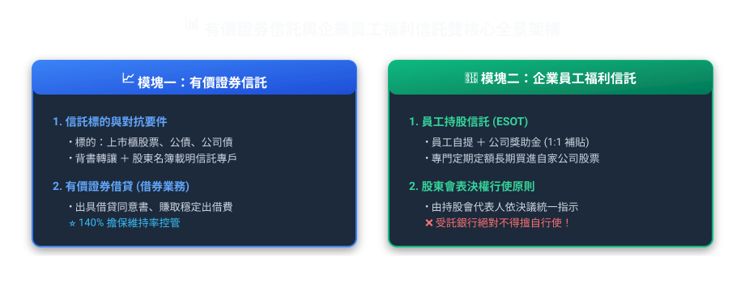
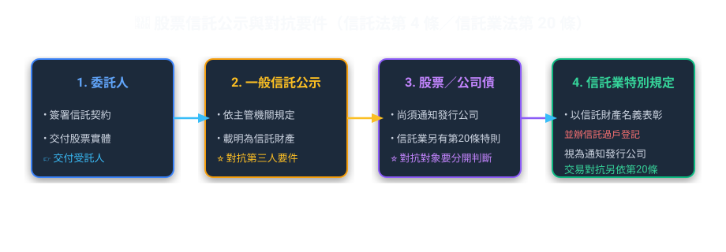
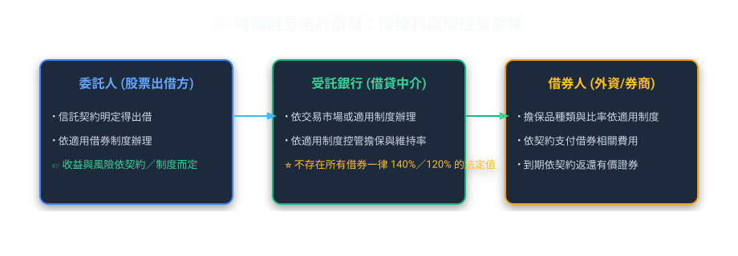
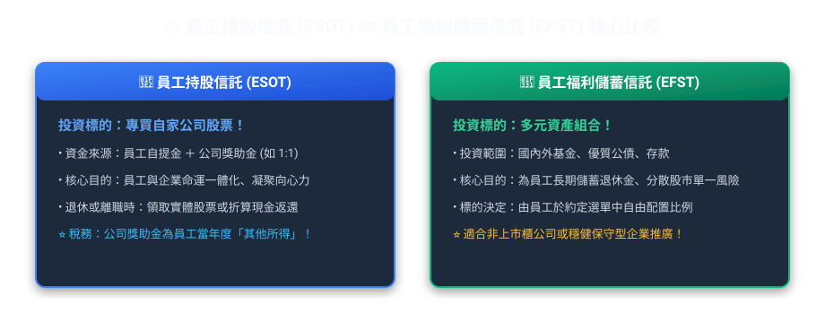
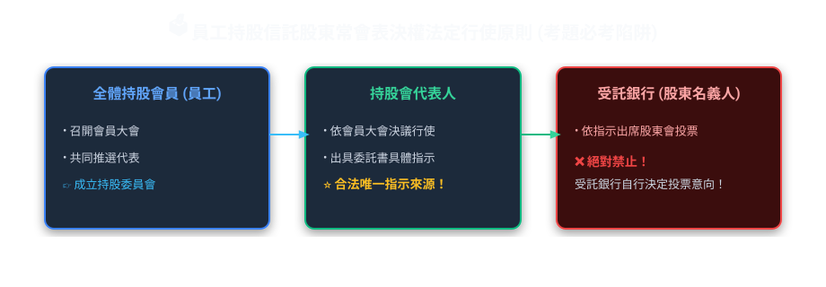

# 第 05 章：有價證券信託與企業員工福利信託（實務篇）

---

## 🎯 本章學習導航與核心地圖

在信託實務試題中，「有價證券信託」與「員工福利信託」合計佔比將近 **40%**。
這兩大業務深深貼近現代企業運作與家庭財富傳承，特別是**股票表決權由誰行使**、**借券業務（有價證券借貸）**以及**員工持股會的運作架構**，考點極其固定！

---

## 📈 一、有價證券信託核心制度

### 1. 對抗要件手續（考過上百次！）
信託財產為有價證券（如上市公司股票）時，必須完成**「兩手策略」**：
1.  **物理背書**：由受託人與委託人於股票背面之轉讓過戶申請書**背書載明為信託財產**。
2.  **登記備查**：檢附信託契約，通知發行公司並於**公司股東名簿載明「某某銀行受託某某人信託財產專戶」**。
*   👉 **若未完成上述兩項，不得對抗發行公司及第三人！**

---

### 2. 有價證券借貸（借券業務）實務

把手頭上龐大的台積電股票信託給銀行，平時放著領股息，如果能借給外資放空或避險，還能多賺一筆「借券利息」，這就是有價證券借貸業務！

*   **法規關鍵要件**：
    1.  **事先授權**：信託契約中必須明訂，或事先取得**委託人（自益信託）或受益人（他益信託）的書面同意**。
    2.  **擔保維持率**：借券人必須繳交法定比率之擔保品（通常在 140% 以上），低於維持率時受託人應通知補繳，否則立刻處分擔保品買回股票（斷頭平倉）。
    3.  **除權除息補償**：借券期間若遇股票發放股利或現金增資，借券人必須按約定給予**權益補償**，不能損及信託財產利益。

---

## 👥 二、企業員工福利信託：持股信託 vs 福儲信託

【台積電型員工持股信託與員工福儲信託實務雙軌剖析】
科技大廠為留住優秀人才，實施員工福利信託制度：
① **組織與提撥**：全體員工推選代表成立「員工持股會」，由持股會代表與受託銀行簽約開立信託專戶。工程師每月自願自薪資扣繳 1 萬元，公司提供 100% 相對獎勵金 1 萬元，合計每月 2 萬元匯入該專戶；
② **投資標的差異（重要考點）**：
   *   **員工持股信託（ESOT）**：信託資金依約定專門在市場持續買入「自營雇主公司（自家公司）的股票」；
   *   **員工福儲信託（EFST）**：投資標的多元化，除了自家股票外，更可配置於國內外基金、優質公債、金融債或定存，分散單一公司風險；
③ **稅務與返還陷阱（必考）**：公司每月提撥的 1 萬元獎勵金，在提撥當月即屬於員工的「薪資所得」，公司須依法扣繳；員工若工作未達約定年限提前離職，員工自提部分可 100% 領回，但公司提撥的股份則依契約規定可能由公司收回或折減！

### 1. 員工持股信託 vs 員工福儲信託 差異對照表

| 比較維度 | 員工持股信託（ESOT） | 員工福儲信託（EFST） |
| :--- | :--- | :--- |
| **主要投資標的** | **純粹投資本公司或關係企業之上市櫃股票** | **不限於自家股票**，可投資基金、存款、債券等多元商品 |
| **主要目的** | 讓員工成為股東，同甘共苦、防止敵意併購、激勵士氣 | 著重於員工退休金準備、分散資產配置、避險保值 |
| **組織機制** | 設立「員工持股會」 | 設立「員工福利儲蓄會」 |

---

## 🏛️ 三、員工持股會組織架構與表決權行使（必考核心！）

信託銀行買了一大堆公司股票，股東會時誰去投票？是銀行自己投，還是員工親自去投？

### 1. 股東會表決權的三大鐵律
1.  **受託銀行不得擅自行使**：銀行只是信託保管機構，**絕對不能自己隨意拿客戶的信託股票去投票護航現任董事或介入經營權**！
2.  **行使主體**：由**持股會代表人**代表全體會員出席行使，或由持股會出具書面指示，委託受託機構代理出席並依指示行使。
3.  **意見分歧之處理**：若會員大會無法作成單一決議，實務上通常按贊成與反對之比例，分別行使表決權（或採不分割投票依多數意見行使，依章程規定）。

---

## 🚪 四、退會與解約處理（離職、退休怎麼分？）

當員工離職、資遣或退休時，累積在持股專戶裡的股票和現金如何拿回？

1.  **退休或逝世**：依契約約定，通常得選擇**請求交付現物股票**（將股票撥轉至其個人證券集保戶頭），或由受託人於集中市場賣出後**交付現金**。
2.  **中途自願退會或跳槽離職**：
    *   員工自行提撥金所購之股票與現金：百分之百歸還離職員工。
    *   公司獎助金部分：依企業留才條款（歸屬比例 Vesting Schedule）約定，服務未滿特定年資者，公司補助部分可能依約收回或沒收！
