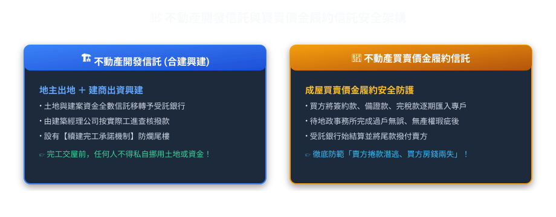
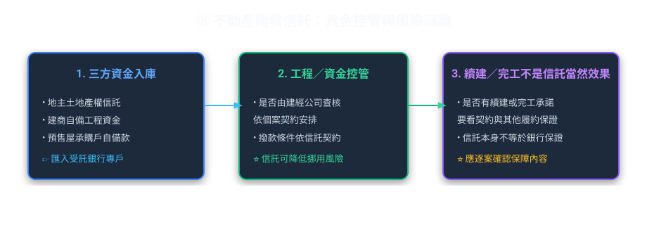
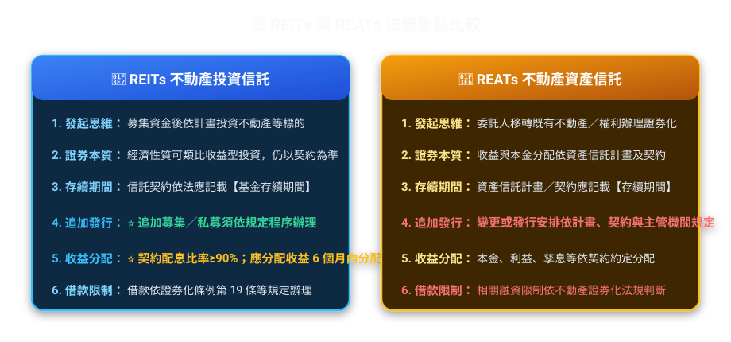
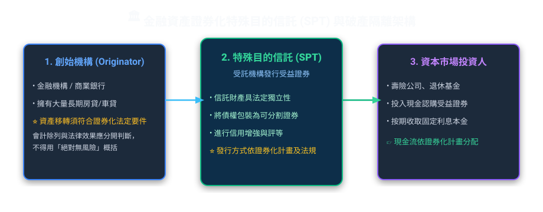
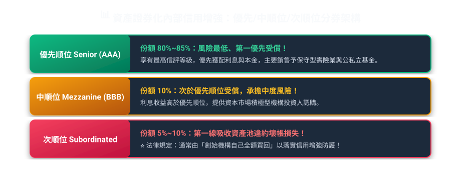

# 第 06 章：不動產信託與資產證券化（實務篇）

---

## 🎯 本章學習導航與核心地圖

不動產信託與證券化（在實務考題中佔比約 **17.5%**，308 題），是現代金融機構承辦數十億元巨額開發案與財富管理的核心利器。
本章主要由兩大支柱構成：
1. **防止爛尾樓的「不動產開發與價金信託」**。
2. **將不動產變現流動的「REITs vs REATs」與「金融資產證券化（SPT）」**。

---

## 🏗️ 一、不動產開發信託與買賣價金信託（防爛尾防線）

買預售屋最怕遇到建商把買方繳的工程款拿去炒股、或者建商中途破產蓋一半落跑！
信託制度如何成為保護購屋族與地主的「定海神針」？

### 1. 不動產開發信託 vs 買賣價金信託 秒懂比較

| 項目 | 不動產開發信託 | 買賣價金信託 |
| :--- | :--- | :--- |
| **信託財產內容** | **土地所有權 ＋ 興建興造資金 ＋ 起造人名義** | **僅有買方所繳納之購屋預收款（價金）** |
| **主要防範風險** | 土地被地主拿去借高利貸抵押、建商資金挪用、產權糾紛 | 建商交屋前捲款潛逃、挪作他用 |
| **續建機制** | **有**（通常配合建經公司提供續建完工保證） | **原則無續建機制**（僅退還剩餘價金） |

---

## 🏢 二、不動產證券化：REITs vs REATs 雙雄世紀對決

這是**歷屆出題最愛考的超級大重點**！兩者雖然只差一個字母，但本質與運作機制完全不同：

### 1. REITs vs REATs 終極必考對照表

> **💡 實務精選案例【國泰一號不動產投資信託基金（REIT）之大眾包租公實戰】**：
> ① **REIT（不動產投資信託，例如國泰一號）**：受託機構向大眾募集 150 億元資金，買下台北喜來登飯店、西門大樓等多處優質收益型不動產。該基金在證券交易所掛牌上市（代碼01001T），投資人持有受益證券享有大樓租金配息與增值利益；原則上為**封閉型**（不得隨時贖回，只能在市場賣出），且每年淨收益必須**90% 以上強制配息**，並應於**會計年度結束後 6 個月內**分配完畢！
> ② **REAT（不動產資產信託，例如老牌飯店資產活化）**：某日月潭老牌飯店擁有價值 30 億元建築，為籌資整修，將飯店建築信託給土地銀行發行 5 年期、利率 3.2% 之 REAT 受益證券籌資 15 億元。性質偏向固定收益債券，期滿由受託人處分飯店或業主買回以全額還本。

| 比較項目 | 不動產投資信託（REITs） | 不動產資產信託（REATs） |
| :--- | :--- | :--- |
| **發起出資思維** | **投資型**：先找投資人的錢，再去買房地產收租金 | **融資型**：委託人手頭有現成大樓，為取得資金而信託發行證券 |
| **證券本質** | 屬於**收益型/股權型**（享受房價上漲與租金分紅） | 屬於**債券型/固定收益型**（約定固定利率與到期還本） |
| **到期日** | 通常**無固定到期日**（或長達數十年） | 具有**固定到期期限**（如 3 年、5 年到期還本） |
| **追加募集** | 符合條件下**得追加募集** | 標的財產已固定，**不得追加發行**！ |
| **收益分配比率** | 每年收益應分配達**可分配收益之 90% 以上**，並於**會計年度結束後 6 個月內**分配完畢 | 依受託契約約定按期支付利息本金 |
| **借款限制** | 經主管機關核可後得進行融資借款 | 原則上不得借款（除非為修繕等特定目的） |

> **🔥 考古題解題口訣**：
> *   題目看到「**得追加發行**」、「**收益分配達 90%**」、「**年度終了後 6 個月內分配**」👉 **秒選 REITs**！
> *   題目看到「**以現有不動產移轉**」、「**不得追加發行**」、「**有固定到期日**」👉 **秒選 REATs**！

---

## 💳 三、金融資產證券化：特殊目的信託（SPT）與破產隔離

銀行手上有上百億元的 30 年期房屋貸款，雖然每年有利息收入，但資金被死死卡住 30 年不能動。
如何把這 100 億房貸立刻變現？答案就是**金融資產證券化**！

### 1. 什麼是「真實出售（True Sale）」與「破產隔離（Bankruptcy Remoteness）」？

*   **黃金案例【中信銀行（創始機構）擁有 100 億元真實出售與破產防火牆】**：
    中信銀行（創始機構）手中有 100 億元的優質自用住宅房貸債權，為提前取回流動性資金以承做更多放款，決定辦理特殊目的信託（SPT）：
    ① **真實出售（True Sale）**：中信銀行將這 100 億元的房貸資產池「法律上完全移轉」給土地銀行信託部（受託機構），土銀對外公開發行受益證券向市場投資人籌得 100 億元資金並支付給中信銀行。
    ② **破產隔離（神聖防火牆）**：一旦完成移轉，資產池即完全脫離中信銀行的資產負債表。即便未來中信銀行不幸倒閉破產，中信銀行的破產管理人或其龐大債權人，「絕對無權」向這 100 億元的房貸資產池主張任何查封或清償權益！這 100 億元的房貸還款現金流將 100% 專門用於償付投資人的受益證券本息，這就是證券化降低融資成本的核心秘密。
    📌 **解題口訣**：「真實出售脫母體，資產信託設隔離，創始破產動不得，專戶本息享安心」

*   **真實出售**：創始機構（銀行）必須把資產「斷絕關係」賣給受託機構，不能保留追索權。
*   **破產隔離（白話）**：
    創始機構如果隔天破產倒閉，它的債權人**絕對不能去動用 SPT 特殊目的信託裡的任何一塊錢**！投資人的權益完好無損，這就是破產隔離的魔力！

---

### 2. 內部信用增強機制：切蛋糕分等級（優先與次順位）

為了讓投資人安心購買受益證券，SPT 會把發行的證券進行「分級切片」：

*   **優先順位證券（Senior）**：享有最優先分配本金利息的權利，風險最低、信評最高（通常 AAA 級）。
*   **次順位證券（Subordinated）**：又稱「劣後證券」或「吸收損失緩衝墊」。只要資產池有人房貸違約不繳，**先扣次順位證券的錢**！直到次順位全賠光了，才會傷到優先順位！
*   **超額擔保（Over-collateralization）**：信託資產總額（如 110 億）大於發行證券總額（如 100 億），多出來的 10 億就是額外的安全緩衝墊。
