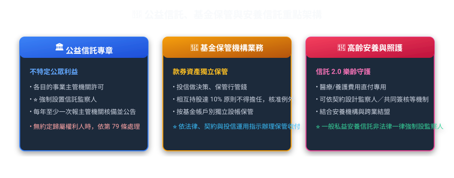
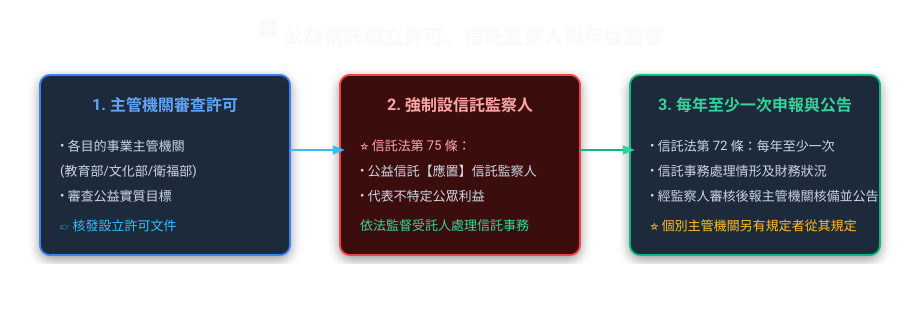
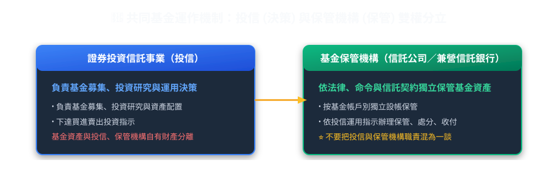
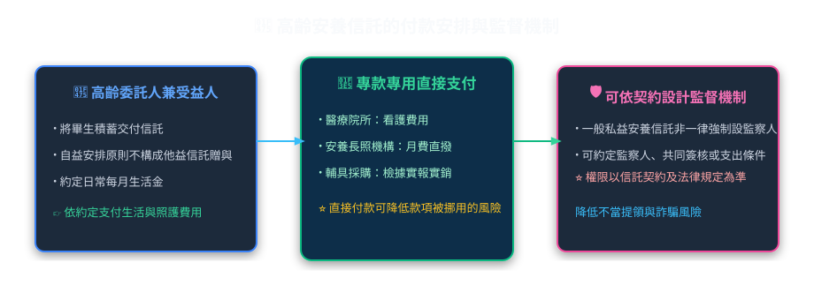

# 第 07 章：公益信託、基金保管與安養照護信託（實務篇）

---

## 🎯 本章重點

這章談三件事：公益信託怎麼設立和監督、基金保管機構做什麼，以及如何用信託安排長輩或身心障礙者的照顧費。法定義務要依《信託法》和金管會現行投信投顧規範判斷；安養照護信託的付款方式等細節，則要看契約怎麼約定。

---

## 🏛️ 一、公益信託：用信託做公益（信託法第 69~85 條）

公益信託可用於獎助學、醫療救助、文化、環境保育等公共利益目的。依《信託法》第 70 條，公益信託的設立及其受託人均須經目的事業主管機關許可，並受該主管機關持續監督。

### 1. 公益信託與私益信託怎麼分

| 比較項目 | 私益信託（一般民事/商業信託） | 公益信託（信託法第 8 章） |
| :--- | :--- | :--- |
| **設立方式** | 原則上以契約或遺囑為之 | 契約、遺囑；另依第 71 條，**法人**為增進公共利益，經決議及主管機關許可後，得以宣言方式成立公益信託 |
| **主管機關許可** | 一般私益信託無公益信託的許可程序 | 公益信託之設立及受託人，**均應經目的事業主管機關許可** |
| **信託監察人設置** | 依信託行為或法律規定選任 | 第 75 條明定公益信託**應置信託監察人** |
| **受託人辭任規定** | 除信託行為另有約定外，須經委託人及受益人同意；有不得已事由時，得聲請法院許可 | **非有正當理由，並經主管機關許可，不得辭任** |
| **信託消滅財產歸屬** | 依第 65 條及信託行為約定處理 | **先看信託行為有無約定歸屬權利人**；若沒有，第 79 條規定主管機關得為類似目的使信託關係存續，或移轉予有類似目的之公益法人或公益信託 |

> **常見的三個錯誤說法**：
> *   **說法 1**：公益信託之主管機關一律為金融監督管理委員會？
>     *   👉 **錯！** 是依其業務性質由各「**目的事業主管機關**」管轄（例：助學金歸教育部、醫療救助歸衛福部、環境保育歸環境部）。
> *   **說法 2**：公益信託得由委託人自由決定是否設置信託監察人？
>     *   👉 **錯！** 法律明定**「應」**設置信託監察人，一人或數人均可。
> *   **說法 3**：公益信託消滅時，一律由法律直接把剩餘財產移給類似公益法人？
>     *   👉 **錯。** 第 79 條的前提是「**沒有信託行為所定的歸屬權利人**」。在此前提下，主管機關才得為類似目的使信託關係存續，或將財產移轉予有類似目的之公益法人或公益信託。

### 2. 年度監督與申報
依《信託法》第 72 條，受託人應**每年至少一次**，將信託事務處理情形及財務狀況送公益信託監察人審核後，報請主管機關核備並公告。法律本文並沒有一律規定「會計年度終了後 3 個月內」；若各目的事業主管機關另有許可監督規定，則另依該規定辦理。

---

## 🏦 二、基金保管機構：分開保管基金資產

證券投資信託基金的資產應與投信事業及基金保管機構的自有財產分別獨立；基金保管機構並依法律、命令及證券投資信託契約，按基金帳戶別獨立設帳保管基金資產。

### 1. 投信公司與保管機構的持股限制
*   依《證券投資信託基金管理辦法》第 59 條，信託公司或兼營信託業務之銀行，如投資於該投信事業已發行股份總數**達 10% 以上**，或該投信事業持有其已發行股份總數**達 10% 以上**，原則上不得擔任該投信事業之基金保管機構；但經金管會核准者例外。
*   同條另列董事、監察人交叉任職、同一金融控股公司子公司或互為關係企業等限制，不能只用「10%」概括所有不適格情形。

---

### 2. 投資指示超出契約範圍時怎麼辦

全權委託投資業務必須建立「越權交易之防範」控制作業，保管機構亦須依全權委託契約及相關法令辦理保管、收付與監督。若投資指示逾越契約或法令限制，應依適用法規、契約及內部控制程序處理；教材不再把特定業者作業流程（例如一律拒絕交割、固定副知特定機關、由投信自有資金承接）寫成所有案件都適用的法定程序。

---

## 👵 三、高齡安養與身心障礙者照護信託

家人可能想先安排兩件事：
1. 長輩失智或生重病後，生活費和醫療費如何按需要支付，避免存款被人擅自提領。
2. 父母過世後，留給身心障礙子女的照顧費如何持續用在子女身上。

*   **按約定用途付款**：契約可約定由受託人從信託財產支付長輩的生活費、護理院費或醫療費，也可約定直接付給安養院或醫院，降低款項被挪作他用的風險。
*   **可透過契約增加監督機制**：一般私益安養信託並非法律一律強制設置信託監察人；實務上可依需求在契約中設計信託監察人、共同簽核、定期報告或特定支出條件。監察人的權限以信託行為及法律規定為準，也不能宣稱能「絕對」排除所有詐騙或不當處分風險。

---

## 📜 官方法規來源

本章依據：[《信託法》第 36、69～85 條](https://law.moj.gov.tw/LawClass/LawAll.aspx?pcode=I0020024)・[《證券投資信託基金管理辦法》第 59、60 條](https://law.moj.gov.tw/LawClass/LawAll.aspx?pcode=G0400082)。安養照護信託的付款與監督方式主要依個別信託契約安排。
