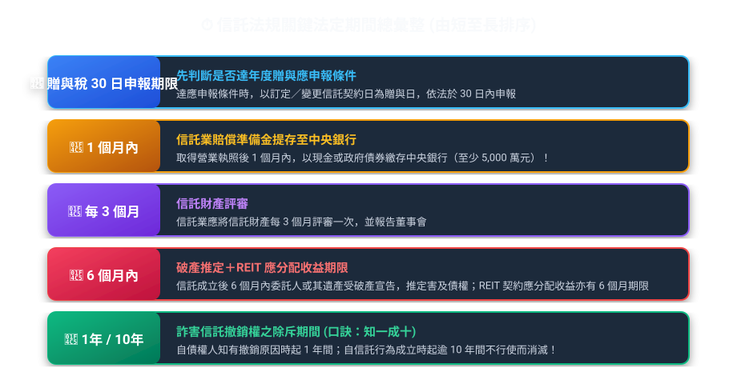
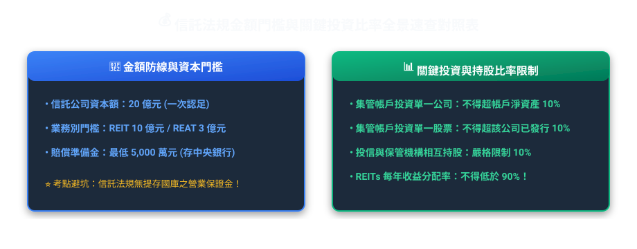
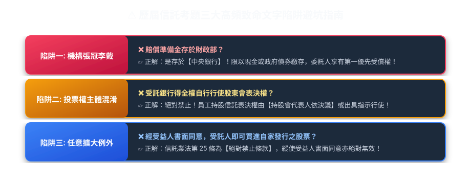

# 第 08 章：歷屆考題高頻數字與易錯陷阱速查手冊（衝刺篇）

---

## 🎯 本章使用說明

信託業務人員測驗中，**「數字記憶」**與**「何者錯誤」逆向題型**（在 2,860 題中佔了 666 題，比例高達 **23.3%**）往往是能否順利通關的分水嶺。
本手冊整理本站歷屆題庫常見的數字、期間、比率與法規名詞，並以法務部、財政部及金管會現行法規資料為校對基準。若題庫舊題與現行法規不一致，以現行法規為準。

---

## ⏱️ 一、必考「時間與期間」速查金榜

| 法定期間 | 法規依據 | 核心事件與考點情境 | 陷阱防範提醒 |
| :--- | :--- | :--- | :--- |
| **20 日前** | 金融資產證券化條例第 24 條 | 受託機構或信託監察人召集受益人會議，應於開會 **20 日前**書面通知各受益人。 | 常被改成「10 日前」或「30 日前」 |
| **30 日** | 遺產及贈與稅法第 24 條、第 24 條之 1 | 委託人有第 5 條之 1 的應課徵贈與稅情形時，以訂定或變更信託契約日為贈與行為發生日；**達第 24 條應申報條件者**，於 30 日內申報。 | 先判斷是否達年度贈與應申報條件，不要把所有他益信託一律寫成「成立後 30 日必報」。 |
| **1 個月** | 信託業法第 34 條 | 信託業取得營業執照後，應於 **1 個月內**以現金或政府債券繳存賠償準備金於中央銀行。 | 常被改成「3 個月」或「營業前」 |
| **2 個月 / 4 個月** | 信託業法第 39 條、施行細則第 17 條 | 半年度營業報告書及財務報告：**半年度終了後 2 個月內**；年度資料：**年度終了後 4 個月內**辦理申報／公告。 | 不要和信託財產「每 3 個月評審一次」混淆。 |
| **3 個月** | 信託業法第 21 條 | 信託業的**信託財產評審委員會每 3 個月至少評審一次**，並報告董事會。 | 不要與公益信託年度報告混淆 |
| **6 個月** | 信託法第 6 條第 3 項 不動產證券化條例第 28 條 | 1. 信託行為成立後 **6 個月內**委託人受破產宣告者，推定該信託行為有害及債權。 2. REIT 依契約約定應分配之收益，應於會計年度結束後 **6 個月內**分配。 | 「90% 配息比率」與「6 個月分配期限」法源不同 |
| **1 年 / 10 年** | 信託法第 7 條 | 詐害信託撤銷權： • 自債權人**知有撤銷原因起 1 年**不行使而消滅。 • 自信託行為**成立時起逾 10 年**者亦同。 | 可用「知一成十」記憶，但仍以條文要件為準 |
| **1 月底前** | 所得稅法第 92 條之 1 | 受託人應填具上一年度各信託的財產目錄、收支計算表、所得額與扣繳稅額等相關文件，向稽徵機關列單申報。 | 每年 1 月遇連續 3 日以上國定假日，申報期間延長至 2 月 5 日 |
| **2 月 10 日前** | 所得稅法第 92 條之 1、第 94 條之 1 | 原則上於每年 **2 月 10 日前**填發相關憑單；符合免填發條件者得免主動填發，納稅義務人要求時仍應提供。 | 遇法定連續假期時，填發期間延長至 2 月 15 日 |

---

## 💰 二、必考「金額、比率與避坑防線」速查金榜

| 項目門檻 | 正確法定數字 | 法規依據 | 記憶口訣與高頻避坑陷阱 |
| :--- | :--- | :--- | :--- |
| **信託公司最低實收資本額** | **新臺幣 20 億元** • 僅辦理 REIT：10 億元 • 僅辦理 REAT：3 億元 | 信託業設立標準第 3、4 條 | 發起人及股東出資以現金為限；發起人應於發起時**一次認足發行股份總額，並至少繳足 20% 股款** |
| **賠償準備金最低門檻** | **新臺幣 5,000 萬元** | 信託業法第 34 條 主管機關公告標準 | 取得執照後 1 個月內以現金或政府債券繳存中央銀行；委託人或受益人有**優先受償權**。每年並依主管機關公告按受託財產計提。 |
| **營業保證金辨識** | 《信託業法》第 34 條規範的是**賠償準備金** | 信託業法第 34 條 | 若選項把一般信託業的第 34 條寫成「向國庫提存資本額 5% 的營業保證金」，即與現行條文不符。 |
| **信託業利害關係人持股標準** | **5%**（主要股東） **10%**（負責人持股企業） | 信託業法第 7 條 | 掌握「**5%**（持有信託業股份）」與「**10%**（負責人等持有企業股份）」兩大關鍵數字！ |
| **集管帳戶投資單一標的上限** | **10%**（雙十原則） | 信託資金集合管理運用管理辦法第 9 條 | • 個別帳戶投資任一公司總額不得超過該帳戶淨資產 **10%** • 全體帳戶投資任一公司總額不得超過該公司實收資本額 **10%** |
| **同一金融機構曝險** | **全體集管帳戶 NAV 30%** 且 **該金融機構淨值 10%** | 同辦法第 9 條第 7 款 | 存款＋該金融機構發行之金融債券＋其保證之公司債及短期票券合併計算 |
| **集管帳戶流動性資產** | 個別帳戶至少 **NAV 5%** | 集合管理運用金錢信託流動性資產範圍及比率準則第 3 條 | 未達最低比率時應即調整 |
| **REIT 收益分配** | 契約每年配息比率 **90% 以上**；契約約定應分配之收益於年度終了後 **6 個月內**分配 | 《受託機構募集或私募不動產投資信託或資產信託受益證券處理辦法》契約應記載事項；《不動產證券化條例》第 28 條 | **90% 是契約配息比率要求；6 個月是已約定應分配收益的分配期限，兩者不要混成同一條規定** |
| **全權委託投資業務資本額辨析** | 投信：**3 億元** 投顧：**3 億元**（免受 20 倍限制） | 投信事業設置標準第 7 條 全權委託投資業務管理辦法第 13 條 | 投信公司門檻為 3 億元；投顧代操若達 3 億元則接受委託金額不受淨值 20 倍限制。 |

---

## 🗳️ 三、必考「會議與表決權門檻」

| 會議與主體 | 事項與法規依據 | 法定出席門檻 | 法定決議同意門檻 |
| :--- | :--- | :--- | :--- |
| **銀行董事會** | 銀行法第 33 條：對利害關係人擔保授信達主管機關規定金額 | **董事三分之二以上出席**（2/3） | **出席董事四分之三以上同意**（3/4） |
| **土地信託受益人會議** | 信託業法第 26 條：以開發為目的之土地信託借入款項 | **受益權總數三分之二以上出席**（2/3） | **出席表決權數過半數同意**（二分之一以上） |
| **證券化受益人會議** | 金融資產證券化條例第 25 條：普通決議事項 | **表決權總數二分之一以上出席**（過半數） | **出席受益人表決權過半數同意** |
| **證券化受益人會議** | 金融資產證券化條例第 26 條：決議有損害特定種類受益人之權利 | **該特定種類表決權總數二分之一以上出席** | **出席受益人表決權三分之二以上同意** |
| **受益人請求召集門檻** | 金融資產證券化條例第 24 條：受益人請求召集會議 | **持有本金持分總數 3% 以上** （請求後 15 日不召集得報主管機關許可自行召集） | 開會 **20 日前**書面通知；重大事項（解任、變更契約）**不得以臨時動議提出**！ |

---

## 🚨 四、「何者錯誤」三大逆向陷阱破題直覺法則

歷屆題目常以「極端字眼」或「張冠李戴」設計干擾選項；判斷時仍應回到法條的原則、例外與適用前提：

1.  **先看「原則」再看「法定例外」**：
    信託業法第 25 條原則上禁止以信託財產從事本身或利害關係人交易，但第 2 項明定：信託契約約定信託業**不具運用決定權**者，不受第 1 項限制；政府發行之債券亦屬例外。看到「絕對禁止、任何情況都不能」時，要先檢查題目是否忽略法定例外。
2.  **「應」vs「得」文字遊戲**：
    *   公益信託依第 75 條**應置信託監察人**；這是明文義務。
    *   受託人**原則上應親自處理**信託事務（寫「得隨意委託他人」者錯誤）。
3.  **「信託財產獨立性」要把法定例外背完整**：
    信託法第 12 條原則上禁止對信託財產強制執行，但例外包括：**信託前已存在於該財產之權利、因處理信託事務所生之權利，以及其他法律有特別規定者**。
